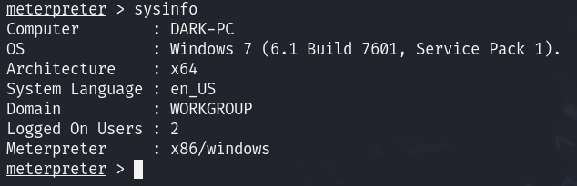

# Ice

## NMAP

    sudo nmap -T4 -A 10.10.33.240

Encontramos un **Microsoft Remote Desktop (MSRDP)** corriendo en el puerto 3389

Un **Icecast streaming media server** corriendo en el puerto 8000

## Icecast

Buscamos vulnerabilidades para este servicio en [CVEdetails](https://www.cvedetails.com/cve/CVE-2004-1561/)

## Metasploit

Buscamos la vulnerabilidad en metasploit

Cambiamos el RHOSTS y ejecutamos el exploit

Podemos ver que usuario lleva el proceso Icecast

Información del sistema

Hacemos un reconocimento, probamos diferentes exploits

    run post/multi/recon/local_exploit_suggester

Ejecutamos uno de los exploits encontrados

Dentro de la nueva sesion veremos más privilegios

## Migramos
Buscamos procesos con ``ps``

In order to interact with lsass we need to be 'living in' a process that is the same architecture as the lsass service (x64 in the case of this machine) and a process that has the same permissions as lsass. The printer spool service happens to meet our needs perfectly for this and it'll restart if we crash it! What's the name of the printer service?

Mentioned within this question is the term 'living in' a process. Often when we take over a running program we ultimately load another shared library into the program (a dll) which includes our malicious code. From this, we can spawn a new thread that hosts our shell. 

Ahora que tenemos permisos de administrador, ejecutamos una herramienta que dumpea las contraseñas

    load kiwi

    

Podemos ver todas las opciones disponibles con ``help``

Obtenemos todas las credenciales

    creds_all

Usando ``hashdump`` obtendremos el hash de las contraseñas

Usando ``screenshare`` podremos ver la pantalla del usuario remoto en tiempo real

Usando ``record_mic`` podemos grabar el microfono del sistema

Usando ``timestomp`` podemos modificar las fechas de los archivos del sistema

Mimikatz allows us to create what's called a ``golden ticket``, allowing us to authenticate anywhere with ease. 

Golden ticket attacks are a function within Mimikatz which abuses a component to Kerberos (the authentication system in Windows domains), the ticket-granting ticket. In short, golden ticket attacks allow us to maintain persistence and authenticate as any user on the domain.

Tambien podemos activar el escritorio remoto

    run post/windows/manage/enable_rdp