# NMAP

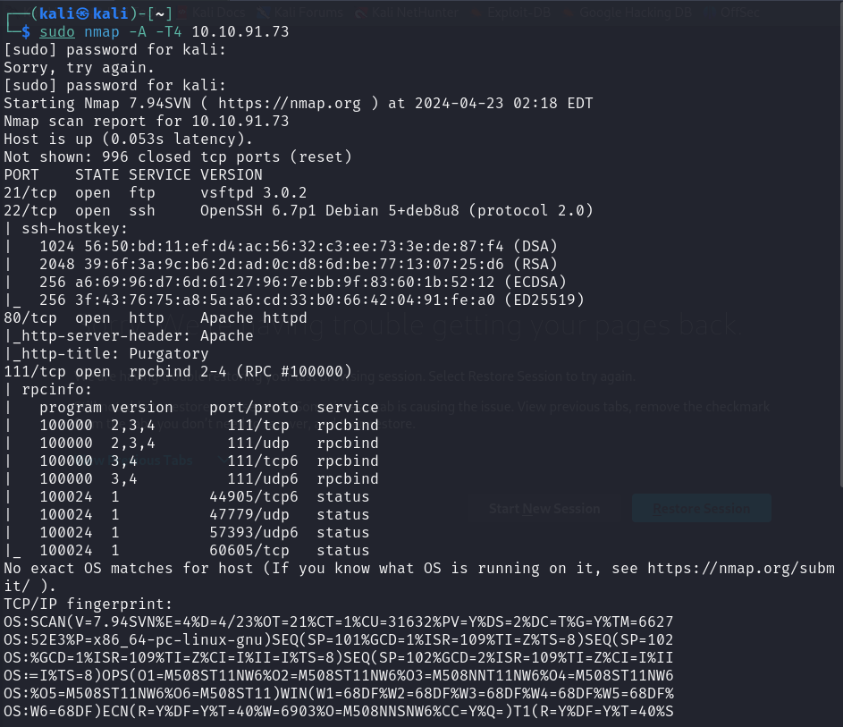

# WEB

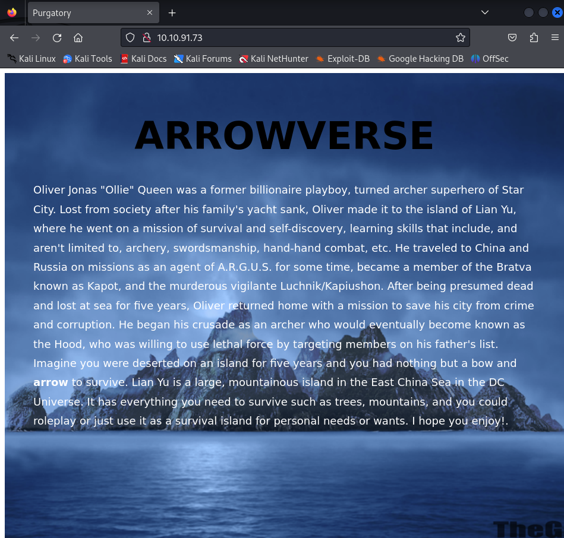

# Fuzzing

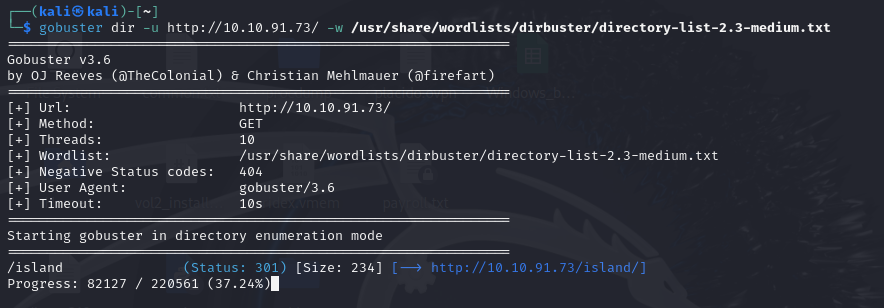

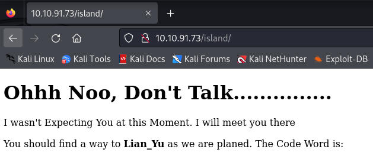

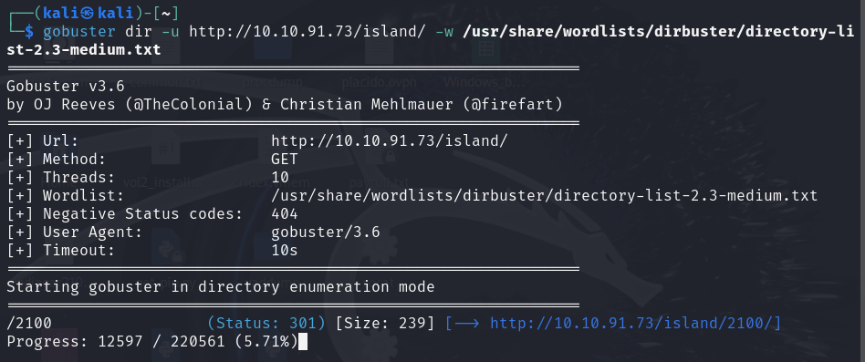

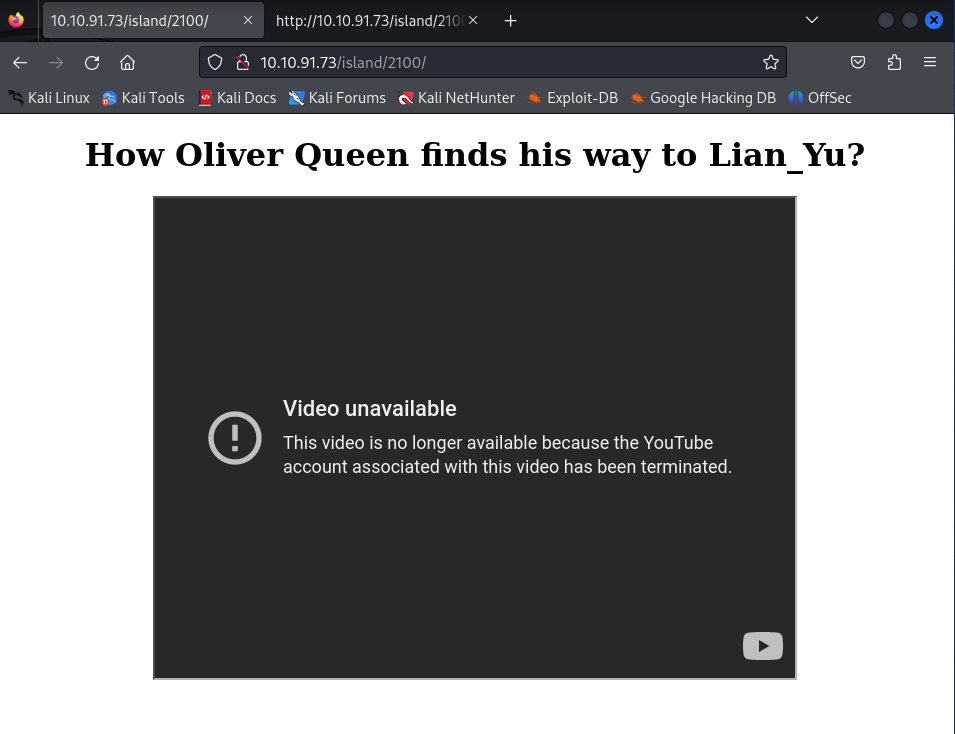

Usando ``-x`` podemos buscar por extension

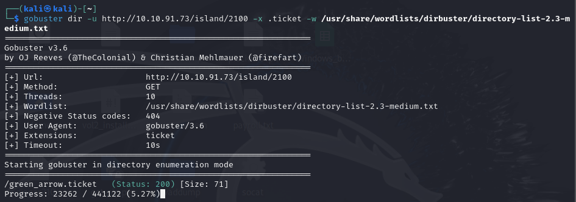

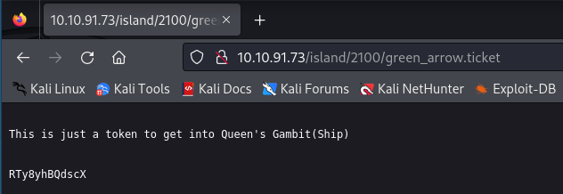

# Decode

Instalamos [Basecrack](https://github.com/mufeedvh/basecrack)

    python3 basecrack.py -f ../ticket 

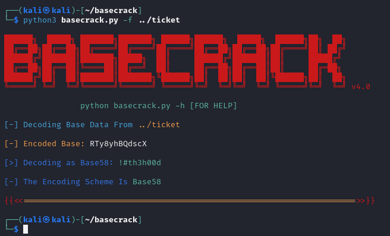

Contraseña FTP: ``!#th3h00d``

# FTP

vigilante

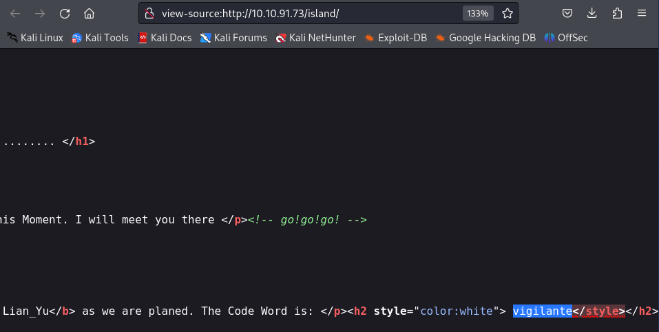

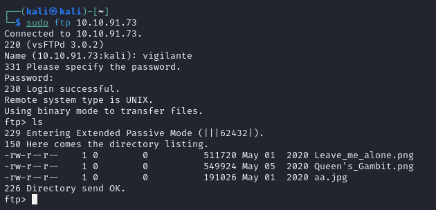

Descargamos las imagenes, encontramos otro usuario `slade`

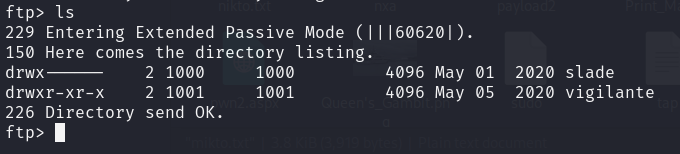

Al ver su contenido vemos que `Leave_me_alone.png` no es una imagen

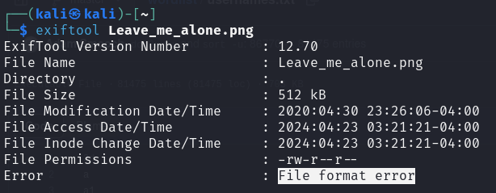

# Fuerza Bruta

    stegcracker ../aa.jpg /usr/share/wordlists/rockyou.txt 

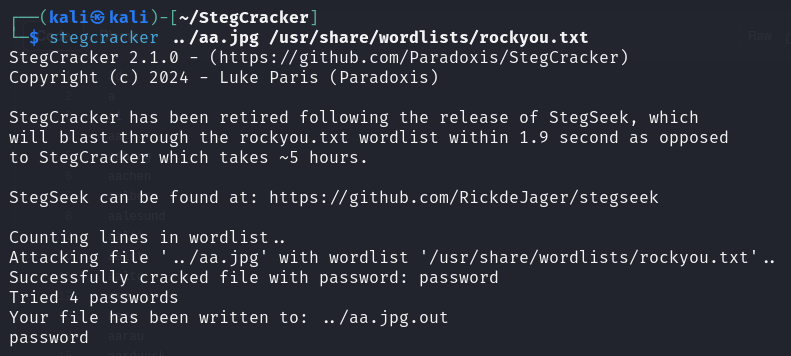

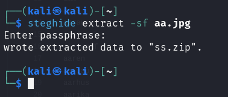

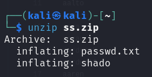

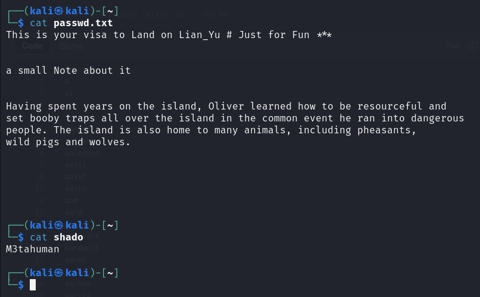

Contraseña ssh: ``M3tahuman``

# SSH

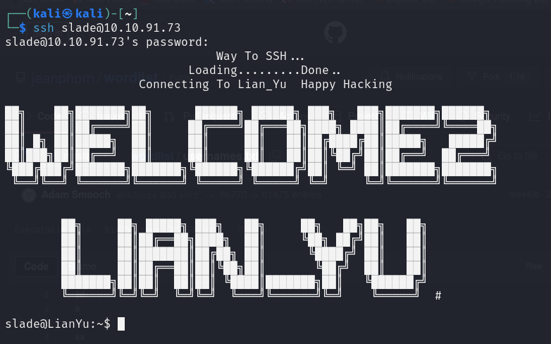

# User Flag

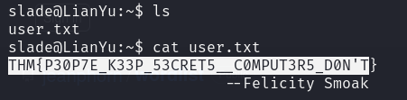

# Escalada de Privilegios

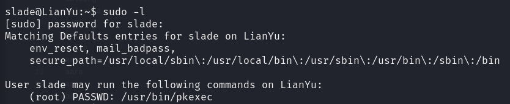

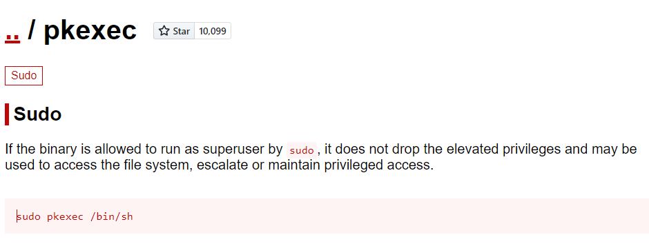

# Root Flag

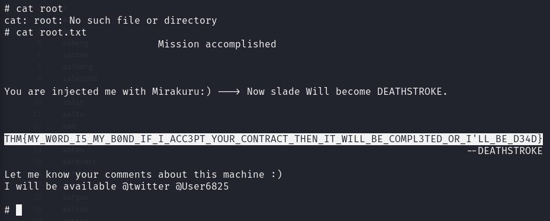

