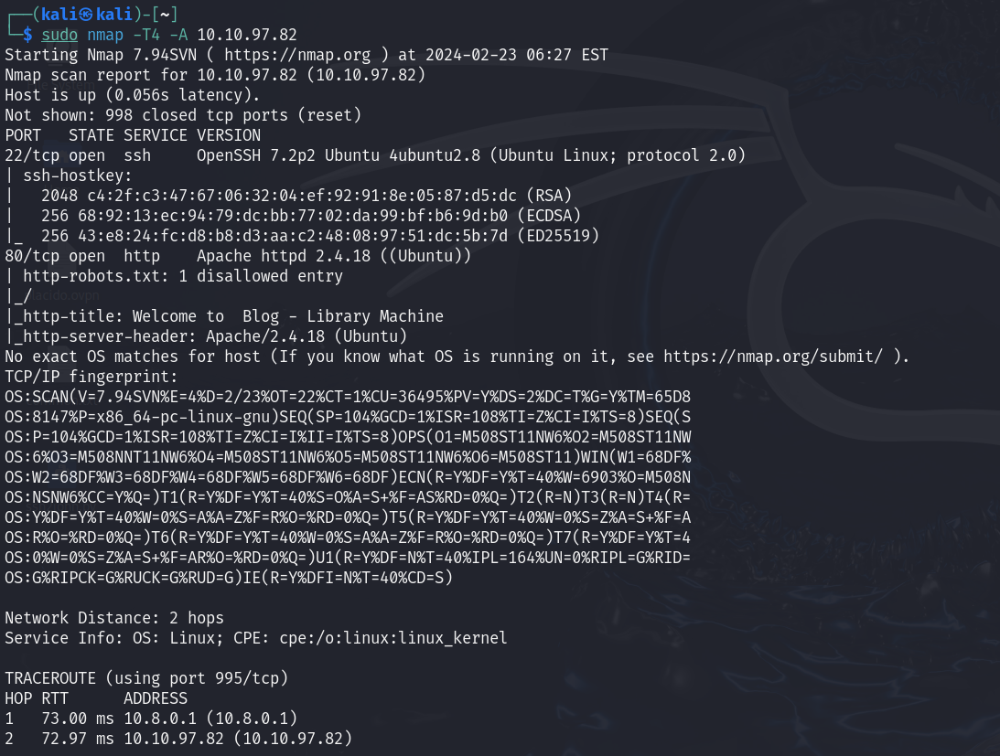
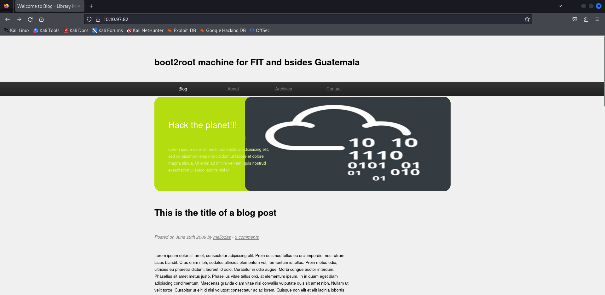
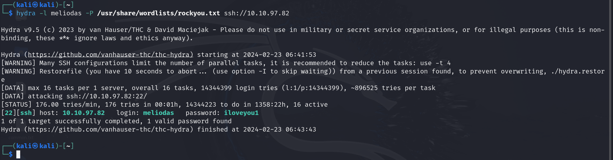
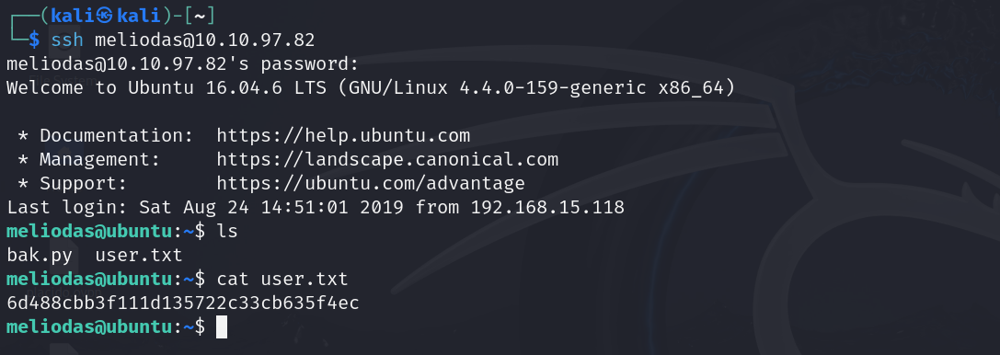
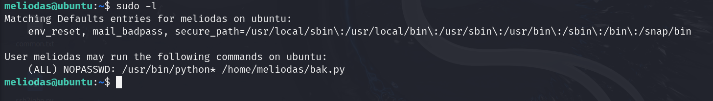
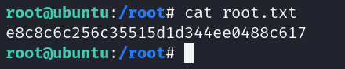

# Library

## Nmap

Podemos ver el nombre de la persona que lo ha puesto el post ``meliodas``

En entramos en el ``robots.txt``

## SSH

Hacemos un ataque de fuerza bruta usando el usuario ``mediolas`` y la lista ``rockyou``

Entramos en el usuario, aqui encontramos ``user.txt``

## Escalada de privilegios

Tenemos un archivo que se encarga de hacer un backup

Vemos los permisos que tenemos

    sudo -l

Borramos el script de backup

    rm -f bak.py

Creamos el archivo de nuevo

Lo ejecutamos y tendremos acceso root

    sudo /usr/bin/python3 /home/meliodas/bak.py

Vamos a la ruta ``/root`` y aqui encontraremos ``root.txt``
