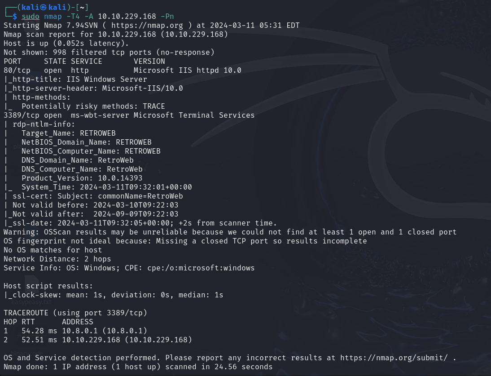
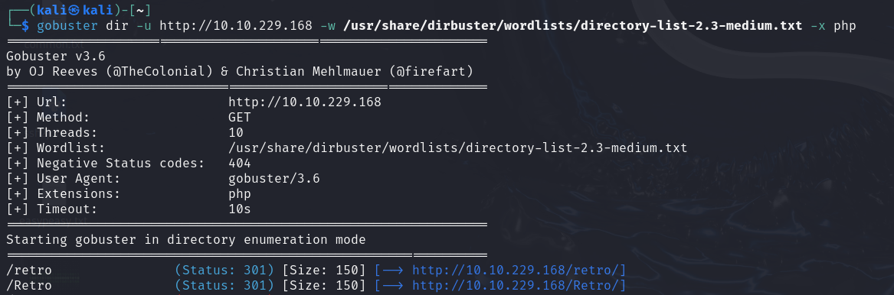
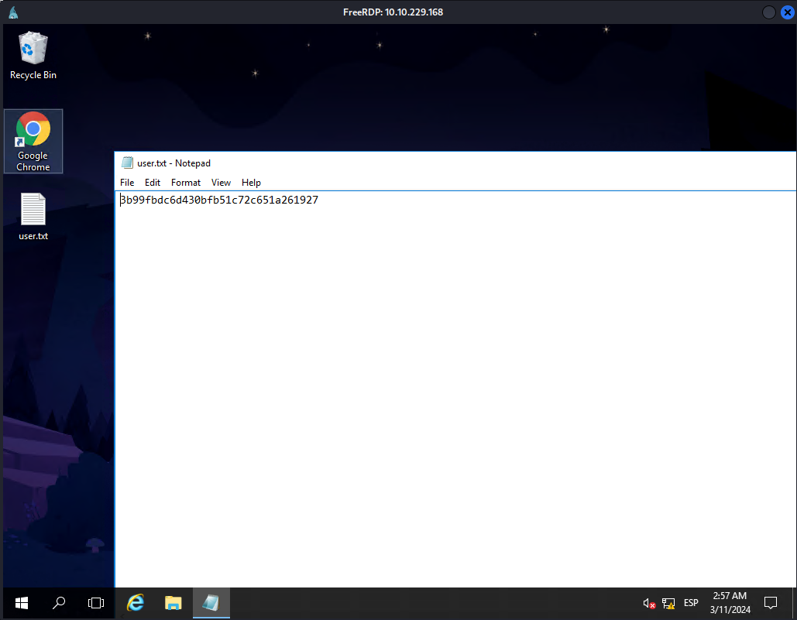
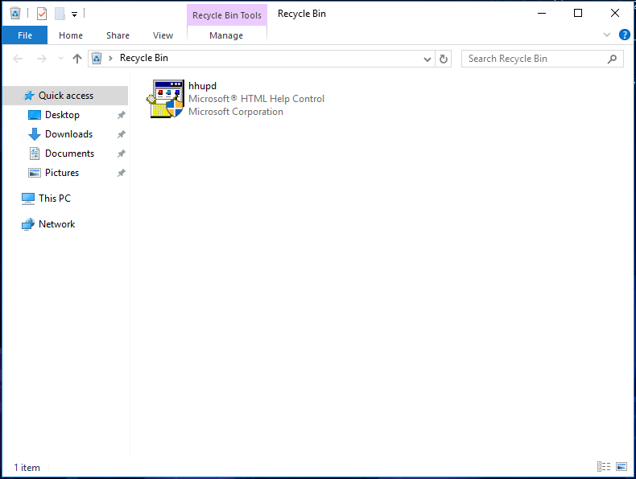
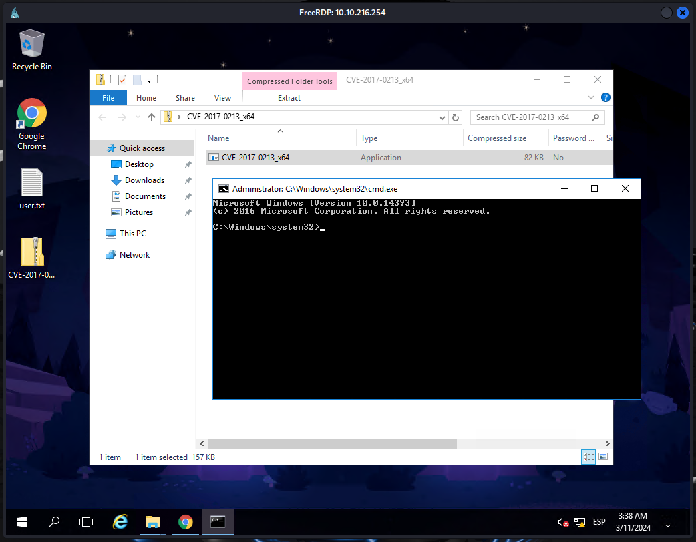
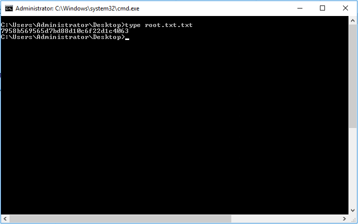

# Retro

## Nmap

## Fuzzing

    gobuster dir -u http://10.10.229.168/ -w /usr/share/dirbuster/wordlists/directory-list-2.3-small.txt -x php

    xfreerdp /u:wade /p:parzival /v:10.10.229.168

En la papelera de reciclaje encontramos un ejecutable que nos permite aumentar los privilegios

Descargamos el [CVE-2017-0213](https://github.com/WindowsExploits/Exploits/tree/master/CVE-2017-0213) y lo ejecutamos en la máquina atacante

Accedemos al escritorio del Administrador, aquí encontraremos el ``root.txt``

