# Anthem

## Nmap

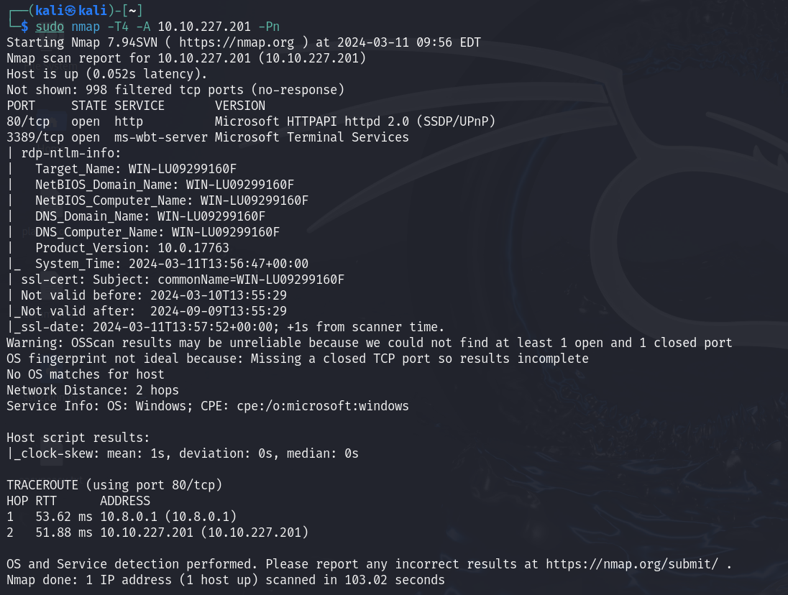

## Web

robots.txt

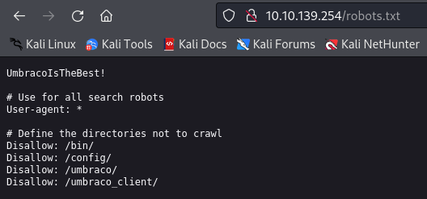

Umbraco login

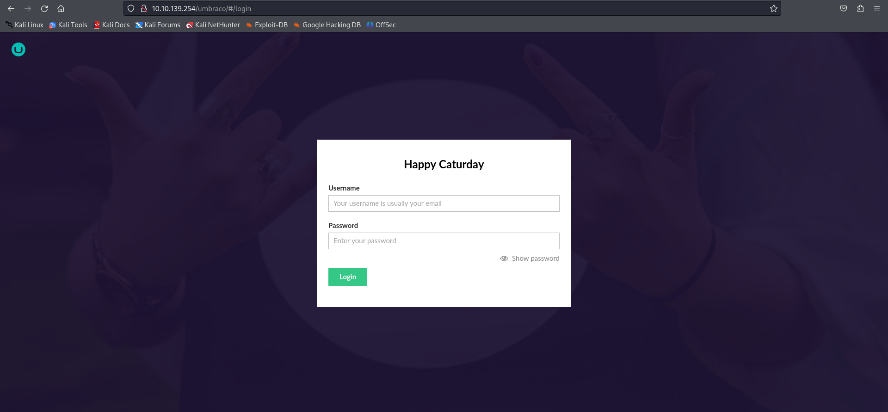

Dominio

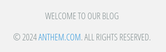

Email

## Flags

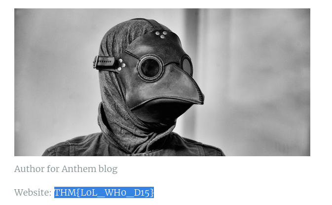

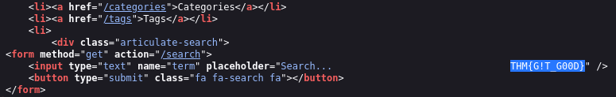

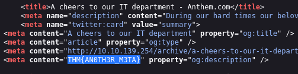

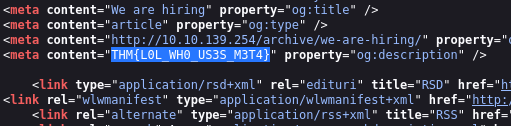

## Pasos Finales

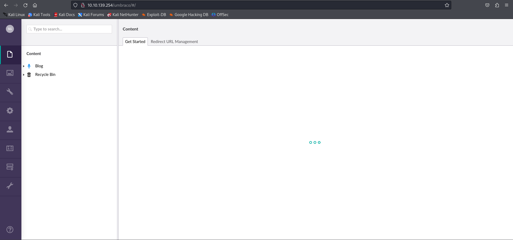

Acceso RDP

    rdesktop -u SD 10.10.139.254

Usamos la contraseña encontrada antes

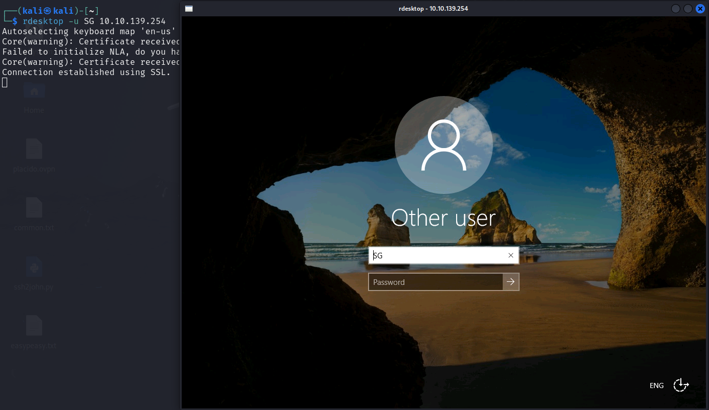

Contenido de ``User.txt``

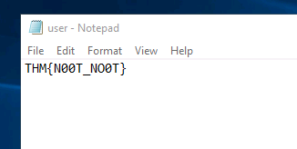

Miramos los archivos ocultos del sistema, encontramos la carpeta ``backup``

Le damos permisos a los usuarios del sistema al archivo

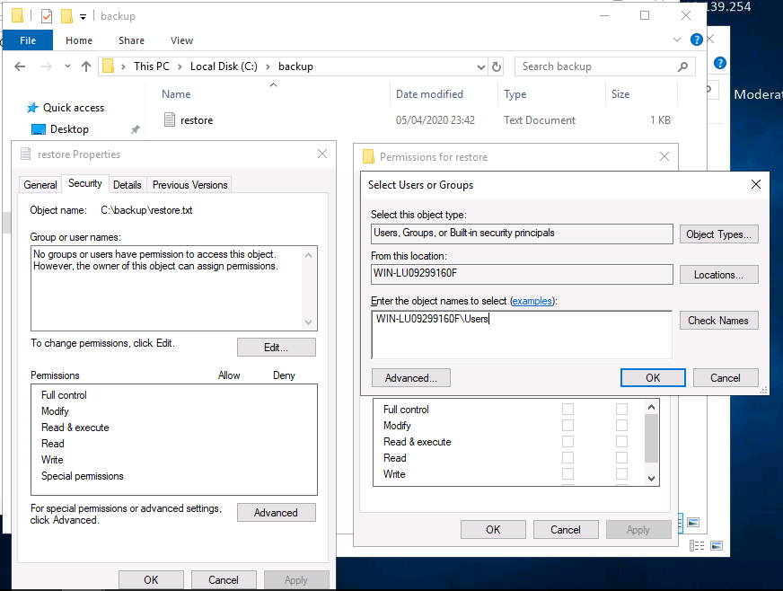

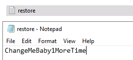

Accedemos al usuario administrador y vemos el contenido de ``root.txt``

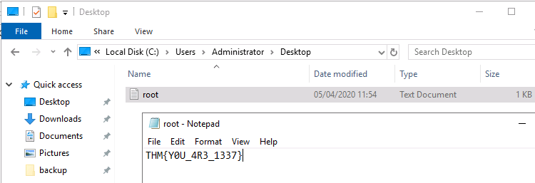

Para ganar acceso de otra manera podríamos ejecutar ``windows-exploit-suggester.py`` y ver los CVE críticos del sistema